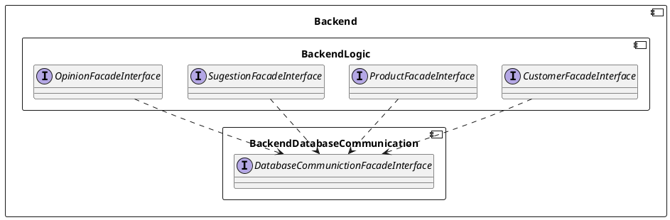
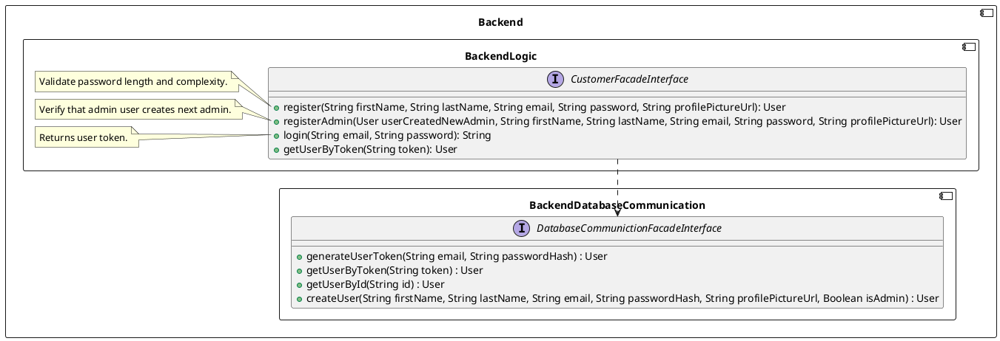

# Backend logic layer

```plantuml
@startuml
component Backend {
    component BackendDatabaseCommunication {
        interface DatabaseCommunictionFacadeInterface
    }
    
    component BackendLogic {
        interface CustomerFacadeInterface
        interface ProductFacadeInterface
        interface SugestionFacadeInterface
        interface OpinionFacadeInterface
        
        CustomerFacadeInterface  ..> DatabaseCommunictionFacadeInterface
        ProductFacadeInterface   ..> DatabaseCommunictionFacadeInterface
        SugestionFacadeInterface ..> DatabaseCommunictionFacadeInterface
        OpinionFacadeInterface   ..> DatabaseCommunictionFacadeInterface
    }
}
@enduml 
```

## CustomerFacade

```plantuml
@startuml
component Backend {
    component BackendDatabaseCommunication {
        interface DatabaseCommunictionFacadeInterface {
            + generateUserToken(String email, String passwordHash) : User
            + getUserByToken(String token) : User
            + getUserById(String id) : User
            + createUser(String firstName, String lastName, String email, String passwordHash, String profilePictureUrl, Boolean isAdmin) : User
        }
    }
    
    component BackendLogic {
        CustomerFacadeInterface  ..> DatabaseCommunictionFacadeInterface
        
        interface CustomerFacadeInterface {
            + register(String firstName, String lastName, String email, String password, String profilePictureUrl): User
            + registerAdmin(User userCreatedNewAdmin, String firstName, String lastName, String email, String password, String profilePictureUrl): User
            + login(String email, String password): String
            + getUserByToken(String token): User
        }
    
        note left of CustomerFacadeInterface::register
            Validate password length and complexity.
        endnote
    
        note left of CustomerFacadeInterface::registerAdmin
            Verify that admin user creates next admin.
        endnote
    
        note left of CustomerFacadeInterface::login
            Returns user token.
        endnote
    }
}
@enduml 
```