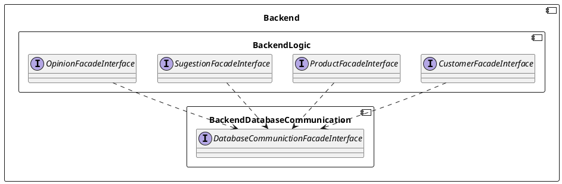
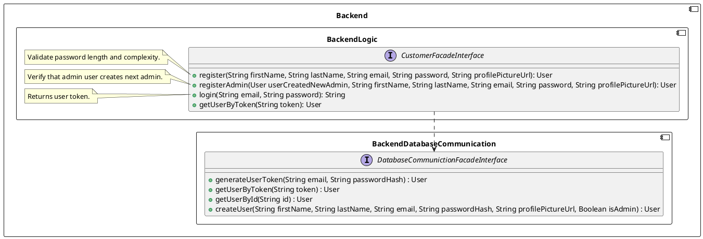
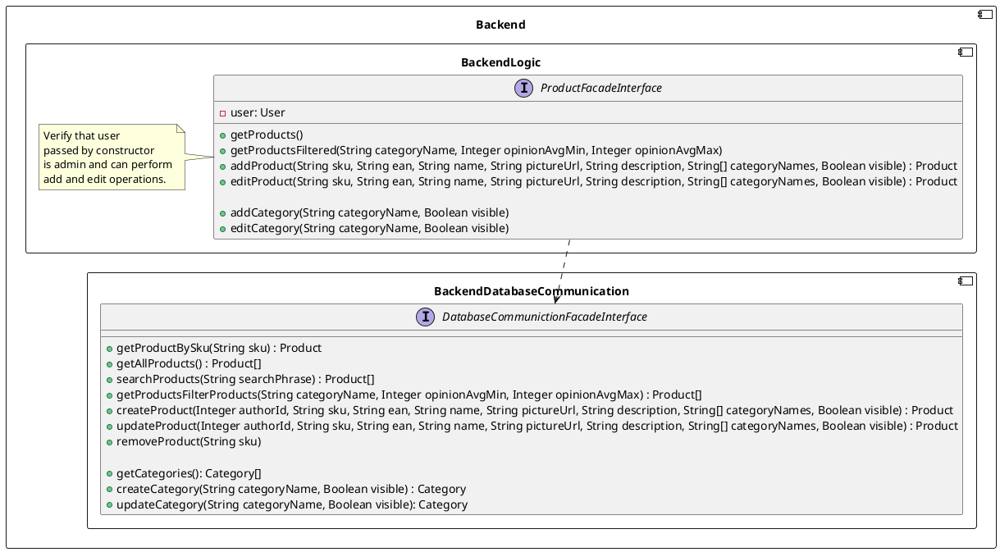

# Backend logic layer

```plantuml
@startuml
component Backend {
    component BackendDatabaseCommunication {
        interface DatabaseCommunictionFacadeInterface
    }
    
    component BackendLogic {
        interface CustomerFacadeInterface
        interface ProductFacadeInterface
        interface SugestionFacadeInterface
        interface OpinionFacadeInterface
        
        CustomerFacadeInterface  ..> DatabaseCommunictionFacadeInterface
        ProductFacadeInterface   ..> DatabaseCommunictionFacadeInterface
        SugestionFacadeInterface ..> DatabaseCommunictionFacadeInterface
        OpinionFacadeInterface   ..> DatabaseCommunictionFacadeInterface
    }
}
@enduml 
```

## CustomerFacade

```plantuml
@startuml
component Backend {
    component BackendDatabaseCommunication {
        interface DatabaseCommunictionFacadeInterface {
            + generateUserToken(String email, String passwordHash) : User
            + getUserByToken(String token) : User
            + getUserById(String id) : User
            + createUser(String firstName, String lastName, String email, String passwordHash, String profilePictureUrl, Boolean isAdmin) : User
        }
    }
    
    component BackendLogic {
        CustomerFacadeInterface  ..> DatabaseCommunictionFacadeInterface
        
        interface CustomerFacadeInterface {
            + register(String firstName, String lastName, String email, String password, String profilePictureUrl): User
            + registerAdmin(User userCreatedNewAdmin, String firstName, String lastName, String email, String password, String profilePictureUrl): User
            + login(String email, String password): String
            + getUserByToken(String token): User
        }
    
        note left of CustomerFacadeInterface::register
            Validate password length and complexity.
        endnote
    
        note left of CustomerFacadeInterface::registerAdmin
            Verify that admin user creates next admin.
        endnote
    
        note left of CustomerFacadeInterface::login
            Returns user token.
        endnote
    }
}
@enduml 
```
## ProductFacade

```plantuml
@startuml
component Backend {
    component BackendDatabaseCommunication {
        interface DatabaseCommunictionFacadeInterface {
            + getProductBySku(String sku) : Product
            + getAllProducts() : Product[]
            + searchProducts(String searchPhrase) : Product[]
            + getProductsFilterProducts(String categoryName, Integer opinionAvgMin, Integer opinionAvgMax) : Product[]
            + createProduct(Integer authorId, String sku, String ean, String name, String pictureUrl, String description, String[] categoryNames, Boolean visible) : Product
            + updateProduct(Integer authorId, String sku, String ean, String name, String pictureUrl, String description, String[] categoryNames, Boolean visible) : Product
            + removeProduct(String sku)
            
            + getCategories(): Category[]
            + createCategory(String categoryName, Boolean visible) : Category
            + updateCategory(String categoryName, Boolean visible): Category
        }
    }
    
    component BackendLogic {
        ProductFacadeInterface  ..> DatabaseCommunictionFacadeInterface
        interface ProductFacadeInterface {
            - user: User
            + getProducts()
            + getProductsFiltered(String categoryName, Integer opinionAvgMin, Integer opinionAvgMax)
            + addProduct(String sku, String ean, String name, String pictureUrl, String description, String[] categoryNames, Boolean visible) : Product
            + editProduct(String sku, String ean, String name, String pictureUrl, String description, String[] categoryNames, Boolean visible) : Product
            
            + addCategory(String categoryName, Boolean visible)
            + editCategory(String categoryName, Boolean visible)
        }
    
        note left of ProductFacadeInterface
            Verify that user
            passed by constructor
            is admin and can perform
            add and edit operations.
        endnote
    }
}
@enduml 
```