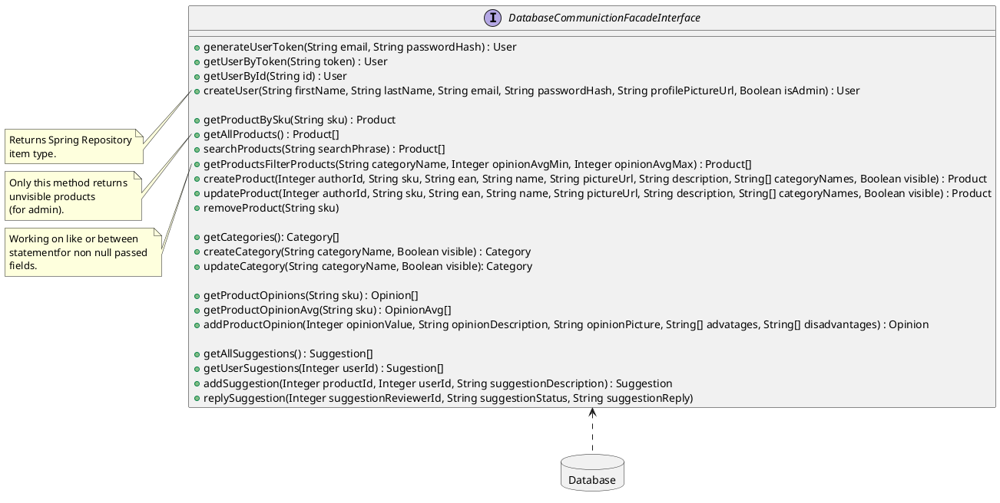

# Backend - Database Communication

```plantuml
@startuml
DatabaseCommunictionFacadeInterface <.. Database

database Database {
}

interface DatabaseCommunictionFacadeInterface {
    + generateUserToken(String email, String passwordHash) : User
    + getUserByToken(String token) : User
    + getUserById(String id) : User
    + createUser(String firstName, String lastName, String email, String passwordHash, String profilePictureUrl, Boolean isAdmin) : User
    
    + getProductBySku(String sku) : Product
    + getAllProducts() : Product[]
    + searchProducts(String searchPhrase) : Product[]
    + getProductsFilterProducts(String categoryName, Integer opinionAvgMin, Integer opinionAvgMax) : Product[]
    + createProduct(Integer authorId, String sku, String ean, String name, String pictureUrl, String description, String[] categoryNames, Boolean visible) : Product
    + updateProduct(Integer authorId, String sku, String ean, String name, String pictureUrl, String description, String[] categoryNames, Boolean visible) : Product
    + removeProduct(String sku)
    
    + getCategories(): Category[]
    + createCategory(String categoryName, Boolean visible) : Category
    + updateCategory(String categoryName, Boolean visible): Category
    
    + getProductOpinions(String sku) : Opinion[]
    + getProductOpinionAvg(String sku) : OpinionAvg[]
    + addProductOpinion(Integer opinionValue, String opinionDescription, String opinionPicture, String[] advatages, String[] disadvantages) : Opinion
    
    + getAllSuggestions() : Suggestion[]
    + getUserSugestions(Integer userId) : Sugestion[]
    + addSuggestion(Integer productId, Integer userId, String suggestionDescription) : Suggestion
    + replySuggestion(Integer suggestionReviewerId, String suggestionStatus, String suggestionReply)
}

note left of DatabaseCommunictionFacadeInterface::createUser
    Returns Spring Repository
    item type.
endnote

note left of DatabaseCommunictionFacadeInterface::getAllProducts
    Only this method returns 
    unvisible products
    (for admin).
endnote

note left of DatabaseCommunictionFacadeInterface::getProductsFilterProducts
    Working on like or between 
    statementfor non null passed 
    fields.
endnote

@enduml 
```