# Database
## Relation between data classes
```plantuml
component Backend {
    component DatabaseCommuniction {
        class Suggestion {
        }
        class User {
            - userId: Integer
            - firstName: String
            - email: String
            - passwordHash: String
            - profilePictureUrl: String
            - admin: Boolean
        }
        class Opinion {
            - opinionId: Integer
            - userId: Integer
            - opinionValue: Integer
            - opinionDescription: String
            - opinionPitureUrl: String
            - advantages: String[]
            - disadvantages: String[]
        }
        class Product {
            - productId: Integer
            - authorId: Integer
            - sku: String
            - pictureUrl: String
            - description: String
            - categoryName: String
        }
        class Category {
            - categoryId: Integer
            - categoryName: String
            - visible: Boolean
        }
        class Suggestion {
            - suggestionId: Integer
            - productId: Integer
            - reviewerId: Integer
            - userId: Integer
            - description: String
        }
        class Review {
            - reviewerId: Integer
            - suggestionId: Integer
            - reply: string
            - status: String
        }
        Product    "1" o-- "0..*" Opinion    : has
        Product    "1" o-- "0..*" Suggestion : has
        Product    "1" *-- "0..*" User       : has autor of
        Product    "1" --- "0..*" Category   : has
        Suggestion "1" o-- "0..*" Review    : has
        User       "1" o-- "0..*" Opinion    : gives
        User       "1" --- "0..*" Suggestion : reviews
        User       "1" o-- "0..*" Suggestion : suggest
        
        UserDatabaseCommuniation        ..> User
        ProductDatabaseCommuniation     ..> Product
        SuggestionDatabaseCommuniation  ..> Suggestion
        OpinionDatabaseCommuniation     ..> Opinion
        CategoryDatabaseCommuniation    ..> Category
        
        DatabaseCommunictionFacadeImplementation ..> User
        DatabaseCommunictionFacadeImplementation ..> Product
        DatabaseCommunictionFacadeImplementation ..> Suggestion
        DatabaseCommunictionFacadeImplementation ..> Opinion
        DatabaseCommunictionFacadeImplementation ..> Category
    }
}
```

## Relation between facade and classes which are using it

```plantuml
@startuml
top to bottom direction
component Backend {
    circle DatabaseCommunictionFacade
    component DatabaseCommunication {
        class DatabaseCommunictionFacadeImplementation {
            + getAllUsers() : User[]
            + createUser(firstName: String, lastName: String, email: String, passwordHash: String, profilePictureUrl: String, isAdmin: Boolean) : User
            + updateUser(userId: Integer, firstName: String, lastName: String, email: String, passwordHash: String, profilePictureUrl: String, isAdmin: Boolean) : User
        
            + getProductBySku(sku: String) : Product
            + getAllProducts() : Product[]
            + getVisibleProducts() : Product[]
            + getProductsFilterProducts(categoryName: String, searchPhrase: String, opinionAvgMin: Integer, opinionAvgMax: Integer) : Product[]
            + createProduct(authorId: Integer, sku: String, name: String, pictureUrl: String, description: String, categoryNames: String[], visible: Boolean) : Product
            + updateProduct(authorId: Integer, sku: String, name: String, pictureUrl: String, description: String, categoryNames: String[], visible: Boolean) : Product
            + removeProduct(sku: String)
        
            + getAllCategories() : Category[]
            + getCategoryByname(name: String) : Category[]
            + createCategory(categoryName: String, visible: Boolean) : Category
            + updateCategory(categoryName: String, visible: Boolean): Category
            + removeCategory(categoryName: String)
            
            + getProductOpinions(sku: String) : Opinion[]
            + addProductOpinion(opinionValue: Integer, userId: Integer, sku: String, opinionDescription: String, opinionPicture: String, advatages: String[], disadvantages: String[]) : Opinion
            + getUserOpinions(userId: Integer) : Opinion[]
            
            + getAllSuggestions() : Suggestion[]
            + getUserSugestions(userId: Integer) : Sugestion[]
            + addSuggestion(sku: String, userId: Integer, suggestionDescription: String) : Suggestion
            + replySuggestion(suggestiontId:Integer, suggestionReviewerId: Integer, suggestionStatus: String, suggestionReply: String)
        }
        
        DatabaseCommunictionFacade -- DatabaseCommunictionFacadeImplementation
        
        class UserDatabaseCommuniation {
            + getAllUsers() : User[]
            + createUser(firstName: String, lastName: String, email: String, passwordHash: String, profilePictureUrl: String, isAdmin: Boolean) : User
            + updateUser(userId: Integer, firstName: String, lastName: String, email: String, passwordHash: String, profilePictureUrl: String, isAdmin: Boolean) : User
        }
        class ProductDatabaseCommuniation {
            + getProductBySku(sku: String) : Product
            + getAllProducts() : Product[]
            + getVisibleProducts() : Product[]
            + getProductsFilterProducts(categoryName: String, searchPhrase: String, opinionAvgMin: Integer, opinionAvgMax: Integer) : Product[]
            + createProduct(authorId: Integer, sku: String, name: String, pictureUrl: String, description: String, categoryNames: String[], visible: Boolean) : Product
            + updateProduct(authorId: Integer, sku: String, name: String, pictureUrl: String, description: String, categoryNames: String[], visible: Boolean) : Product
            + removeProduct(sku: String)
        }
        class SuggestionDatabaseCommuniation {
            + getAllSuggestions() : Suggestion[]
            + getUserSugestions(userId: Integer) : Sugestion[]
            + addSuggestion(sku: String, userId: Integer, suggestionDescription: String) : Suggestion
            + replySuggestion(suggestiontId:Integer, suggestionReviewerId: Integer, suggestionStatus: String, suggestionReply: String)
        }
        class OpinionDatabaseCommuniation {
            + getProductOpinions(sku: String) : Opinion[]
            + addProductOpinion(opinionValue: Integer, userId: Integer, sku: String, opinionDescription: String, opinionPicture: String, advatages: String[], disadvantages: String[]) : Opinion
            + getUserOpinions(userId: Integer) : Opinion[]
        }
        class CategoryDatabaseCommuniation {
            + getAllCategories() : Category[]
            + getCategoryByname(name: String) : Category[]
            + createCategory(categoryName: String, visible: Boolean) : Category
            + updateCategory(categoryName: String, visible: Boolean): Category
            + removeCategory(categoryName: String)
        }
        DatabaseCommunictionFacadeImplementation o-- UserDatabaseCommuniation
        DatabaseCommunictionFacadeImplementation o-- ProductDatabaseCommuniation
        DatabaseCommunictionFacadeImplementation o-- SuggestionDatabaseCommuniation 
        DatabaseCommunictionFacadeImplementation o-- OpinionDatabaseCommuniation
        DatabaseCommunictionFacadeImplementation o-- CategoryDatabaseCommuniation
    }
}

component Database {
}
UserDatabaseCommuniation        -(0- Database : SQL
ProductDatabaseCommuniation     -(0- Database : SQL
SuggestionDatabaseCommuniation  -(0- Database : SQL
OpinionDatabaseCommuniation     -(0- Database : SQL
CategoryDatabaseCommuniation    -(0- Database : SQL
@enduml 
```

# User
```plantuml
circle Users
component Backend {
    component UserLogic {
        class UserController {
            + getAllUsers() : User[]
            + register(firstName: String, lastName: String, email: String, password: String, profilePictureUrl: String, isAdmin: Boolean): User
            + login(email: String, password: String): String
            + update(userId: Integer, firstName: String, lastName: String, email: String, passwordHash: String, profilePictureUrl: String, isAdmin: Boolean) : User
        }
        circle UserFacade
        circle UserAuth
        class UserFacadeImpl {
            + getAllUsers() : User[]
            + register(firstName: String, lastName: String, email: String, password: String, profilePictureUrl: String): User
            + registerAdmin(firstName: String, lastName: String, email: String, password: String, profilePictureUrl: String): User
            + login(email: String, password: String): String
            + updateUser(userId: Integer, firstName: String, lastName: String, email: String, passwordHash: String, profilePictureUrl: String, isAdmin: Boolean) : User
            + getUserByToken(token: String) : User
        }
        UserFacade -- UserFacadeImpl
        UserAuth   -- UserFacadeImpl
        Users -- UserController
        
        UserController "1" o-- "1" UserFacadeImpl
        
        class Mapper {
            +map (object: Object) : Object
        }
        UserController ..> Mapper
    }
    
    component DatabaseCommunication {
        class DatabaseCommunictionFacadeImplementation
        class User
    }
    UserFacadeImpl -(0- DatabaseCommunictionFacadeImplementation : DatabaseCommunication
    UserFacadeImpl ..> User
    
}
```
# Product
```plantuml
circle Products
component Backend {
    component ProductLogic {
        class ProductController {
            + getProductDetails(sku: String) : Product
            + getAllProducts(page: Integer) : Product[]
            + getProducts(page: Integer) : Product[]
            + searchProducts(categoryName: String, searchPhrase: String, opinionAvgMin: Integer, opinionAvgMax: Integer) : Product[]
            + addProduct(sku: String, name: String, pictureUrl: String, description: String, categoryNames: String[], visible: Boolean) : Product
            + editProduct(sku: String, name: String, pictureUrl: String, description: String, categoryNames: String[], visible: Boolean) : Product
            + removeProduct(sku: String)
        }
        class CategoryController {
            + addCategory(categoryName: String, visible: Boolean) : Category
            + editCategory(categoryName: String, visible: Boolean) : Category
            + removeCategory(categoryName: String)
            + getCategories() : Category[]
            + getAllCategories(() : Category[]
        }
        circle ProductFacade
        class ProductFacadeImpl {
            + getProductBySku(sku: String) : Product
            + getAllProducts() : Product[]
            + getProducts() : Product[]
            + getProductsFiltered(categoryName: String, searchPhrase: String, opinionAvgMin: Integer, opinionAvgMax: Integer) : Product[]
            + addProduct(sku: String, name: String, pictureUrl: String, description: String, categoryNames: String[], visible: Boolean) : Product
            + editProduct(sku: String, name: String, pictureUrl: String, description: String, categoryNames: String[], visible: Boolean) : Product
            + removeProduct(sku: String)
            
            + addCategory(categoryName: String, visible: Boolean) : Category
            + editCategory(categoryName: String, visible: Boolean) : Category
            + removeCategory(categoryName: String)
            + getCategories() : Category[]
            + getAllCategories(() : Category[]
        }
        ProductFacade -- ProductFacadeImpl
        CategoryController "1" o-- "1" ProductFacadeImpl
        ProductController  "1" o-- "1" ProductFacadeImpl
        Products -- ProductController
        Products -- CategoryController
        
        class Mapper {
            +map (object: Object) : Object
        }
        CategoryController ..> Mapper
        ProductController  ..> Mapper
    }
    component DatabaseCommunication {
        class DatabaseCommunictionFacadeImplementation
        class Product
        class Category
    }
    ProductFacadeImpl -(0- DatabaseCommunictionFacadeImplementation : DatabaseCommunication
    ProductFacadeImpl ..>  Product
    ProductFacadeImpl ..>  Category
    
    component UserLogic {
        class UserFacadeImpl {
            + getUserByToken(token: String) : User
        }
    }
    ProductController  -(0-- UserFacadeImpl  : UserAuth
    CategoryController -(0-- UserFacadeImpl : UserAuth
}
```
# Suggestion
```plantuml
circle Suggestions
component Backend {
    component SuggestionLogic {
        class SuggestionController {
            + getUserSugestions() : Sugestion[]
            + addSuggestion(sku: String, suggestionDescription: String) : Suggestion
            + getAllSuggestions() : Suggestion[]
            + replySuggestion(suggestiontId:Integer, suggestionStatus: String, suggestionReply: String)
        }
        class SuggestionService {
            + getUserSugestions(userId: Long) : Sugestion[]
            + addSuggestion(userId: Long, sku: String, suggestionDescription: String) : Suggestion
            + getAllSuggestions() : Suggestion[]
            + replySuggestion(reviewerId: Long, suggestiontId:Integer, suggestionStatus: String, suggestionReply: String)
        }
        SuggestionController o-- SuggestionService
        Suggestions -- SuggestionController
    }
    component DatabaseCommunication {
        class DatabaseCommunictionFacadeImplementation
        class Suggestion
    }
    SuggestionService -(0- DatabaseCommunictionFacadeImplementation : UserAuth
    
    component UserLogic {
        class UserFacadeImpl {
            + getUserByToken(token: String) : User
        }
    }
    SuggestionController -(0-- UserFacadeImpl : UserAuth
    SuggestionService    ..> Suggestion
}
```
# Opinion
```plantuml
circle Opinions
component Backend {
    component OpinionLogic {
        class OpinionController {
            + getProductOpinions(sku: String) : Opinion[]
            + addProductOpinion(opinionValue: Integer, sku: String, opinionDescription: String, opinionPicture: String, advatages: String[], disadvantages: String[]) : Opinion
            + getUserOpinions() : Opinion[]
        }
        class OpinionService {
            + getProductOpinions(sku: String) : Opinion[]
            + addProductOpinion(authorId: Integer,opinionValue: Integer, sku: String, opinionDescription: String, opinionPicture: String, advatages: String[], disadvantages: String[]) : Opinion
            + getUserOpinions() : Opinion[]
        }
        OpinionController o-- OpinionService
        Opinions -- OpinionController
    }
    component DatabaseCommunication {
        class DatabaseCommunictionFacadeImplementation
        class Opinion
    }
    OpinionService -(0- DatabaseCommunictionFacadeImplementation : UserAuth
    
    component UserLogic {
        class UserFacadeImpl {
            + getUserByToken(token: String) : User
        }
    }
    OpinionController -(0-- UserFacadeImpl : UserAuth
    OpinionService    ..> Opinion
}
```
# BackendCommunication
## Get
```plantuml
component Frontend {
    circle BackendComunication
    component BackendCommunication {
        enum Get {
            CATEGORIES
            CATEGORIES_ALL
            OPINIONS_PRODUCT
            OPINIONS_USER
            PRODUCTS
            PRODUCTS_ALL
            PRODUCTS_DETAILS
            PRODUCTS_SEARCH
            SUGGESTIONS_ALL
            SUGGESTIONS_USER
            USERS_ALL
        }
        
        class Category {
            + categoryName: String
            + visible: Boolean
        }
        
        class Opinion {
            + advantages: String[]
            + description: String
            + disadvantages: String[]
            + firstName: String
            + opinionValue: Integer
            + opinionAvg: Integer
            + pictureUrl: String
            + sku: String
        }
        
        class ProductGet {
            + categories: Category[]
            + description: String
            + name: String
            + pictureUrl: String
            + sku: String
            + opinionAvg: Integer
            + visible:Boolean
        }
        
        class Page {
            + actualPage: Integer
            + numberOfPages: Integer
            + products: ProductGet[]
        }
        
        class Suggestion {
            + description: String
            + product: ProductGet
            + review: Review
            + reviewer: Reviewer
            + suggestionId: Integer
            + user: User
            + sku: String
        }
        
        class User {
            + email: String
            + firstName: String
            + id: Integer
            + isAdmin: Boolean
            + lastName: String
            + pictureUrl:String
        }
        
        class Review {
            + reply: String
            + status: String
        }
        
        class Reviewer {
            + firstname: String
            + lastname: String
            + profilePictureUrl: String
        }
        
        Suggestion o- Reviewer
        Suggestion o- Review
        Suggestion o- User
        Suggestion o- ProductGet
        
        ProductGet o- Category
        
        Page o- ProductGet
        
        class GetRequest {
            + getCategories(): Category[]
            + getAllCategories(): Category[]
            + getProductOpinions(skuval: String): Opinion[]
            + getProducts(page: Integer): Page
            + getAllProducts(page: Integer): Page
            + getProductDetails(skuval: String): ProductGet
            + getSearchProduct(searchInput: ProductSearch): ProductGet[]
            + getAllSuggestions(): Suggestion[]
            + getUserSuggestions() : Suggestion[]
            + getAllUsers(): User[]
        }
        Get <.. GetRequest
        GetRequest ..> Category
        GetRequest ..> Opinion
        GetRequest ..> Page
        GetRequest ..> ProductGet
        GetRequest ..> Suggestion
        GetRequest ..> User
    }
    BackendComunication - BackendCommunication
}
component Backend {
    component UserLogic {
        class UserController
    }
    component ProductLogic {
        class CategoryController
        class ProductController
    }
    component OpinionLogic {
        class OpinionController
    }
    component SuggestionLogic {
        class SuggestionController
    }
}
        
GetRequest -(0- CategoryController   : Categories
GetRequest -(0- ProductController    : Products
GetRequest -(0- OpinionController    : Opinions
GetRequest -(0- SuggestionController : Suggestions
GetRequest -(0- UserController       : Users
```
## Post
```plantuml
component Frontend {
    circle BackendComunication
    component BackendCommunication {
        enum Post {
            CATEGORIES_ADD
            OPINIONS_ADD
            PRODUCTS_ADD
            SUGGESTIONS_ADD
            USER_LOGIN
            USER_REGISTER
        }
        
        class Category {
            + categoryName: String
            + visible: Boolean
        }
        
        class Opinion {
            + advantages: String[]
            + description: String
            + disadvantages: String[]
            + firstName: String
            + opinionValue: Integer
            + opinionAvg: Integer
            + pictureUrl: String
            + sku: String
        }
        
        class ProductGet {
            + categories: Category[]
            + description: String
            + name: String
            + pictureUrl: String
            + sku: String
            + opinionAvg: Integer
            + visible:Boolean
        }
        
        class ProductSend {
            + categoryNames: String
            + description: String
            + name: String
            + pictureUrl: String
            + sku: String
            + visible:Boolean
        }
        
        class Page {
            + actualPage: Integer
            + numberOfPages: Integer
            + products: ProductGet[]
        }
        
        class Suggestion {
            + description: String
            + product: ProductGet
            + review: Review
            + reviewer: Reviewer
            + suggestionId: Integer
            + user: User
            + sku: String
        }
        
        class UserLogin {
            + email: String
            + password: String
        }
        
        class User {
            + email: String
            + firstName: String
            + id: Integer
            + isAdmin: Boolean
            + lastName: String
            + pictureUrl:String
        }
        
        class UserEdit {
            + email: String
            + firstName: String
            + isAdmin: Boolean
            + lastName: String
            + password: String
            + pictureUrl:String
        }
        
        class Token {
            + token: String
            + type: String
            + user: User
        }
        
        class Review {
            + reply: String
            + status: String
        }
        
        class Reviewer {
            + firstname: String
            + lastname: String
            + profilePictureUrl: String
        }
        
        Suggestion o- Reviewer
        Suggestion o- Review
        Suggestion o- User
        Suggestion o- ProductGet
        
        ProductGet o- Category
        
        Page o- ProductGet
        
        class PostRequest {
            + addCategory(categoryName: String, isVisible: Boolean): Category
            + addOpinion(opinion: Opinion): Opinion
            + addProduct(product: ProductSend): ProductGet
            + addSuggestion(desc: String, skuval: String): Suggestion
            + userLogin(mail: String, pass: String): Token
            + userRegister(user: UserEdit): User
        }
        Post <.. PostRequest
        PostRequest ..> Category
        PostRequest ..> Opinion
        PostRequest ..> ProductGet
        PostRequest ..> ProductSend
        PostRequest ..> Suggestion
        PostRequest ..> Token
        PostRequest ..> User
        PostRequest ..> UserEdit
        PostRequest ..> UserLogin     
    }
    BackendComunication - BackendCommunication
}
component Backend {
    component UserLogic {
        class UserController
    }
    component ProductLogic {
        class CategoryController
        class ProductController
    }
    component OpinionLogic {
        class OpinionController
    }
    component SuggestionLogic {
        class SuggestionController
    }
}
        
PostRequest -(0- CategoryController   : Categories
PostRequest -(0- ProductController    : Products
PostRequest -(0- OpinionController    : Opinions
PostRequest -(0- SuggestionController : Suggestions
PostRequest -(0- UserController       : Users
```
## Put
```plantuml
component Frontend {
    circle BackendComunication
    component BackendCommunication {        
        enum Put {
            CATEGORIES_EDIT
            PRODUCTS_EDIT
            SUGGESTIONS_REPLY
            USER_EDIT
        }
        
        class Category {
            + categoryName: String
            + visible: Boolean
        }
        
        class ProductGet {
            + categories: Category[]
            + description: String
            + name: String
            + pictureUrl: String
            + sku: String
            + opinionAvg: Integer
            + visible:Boolean
        }
        
        class ProductSend {
            + categoryNames: String
            + description: String
            + name: String
            + pictureUrl: String
            + sku: String
            + visible:Boolean
        }
        
        class Suggestion {
            + description: String
            + product: ProductGet
            + review: Review
            + reviewer: Reviewer
            + suggestionId: Integer
            + user: User
            + sku: String
        }
        
        class User {
            + email: String
            + firstName: String
            + id: Integer
            + isAdmin: Boolean
            + lastName: String
            + pictureUrl:String
        }
        
        class Review {
            + reply: String
            + status: String
        }
        
        class Reviewer {
            + firstname: String
            + lastname: String
            + profilePictureUrl: String
        }
        
        Suggestion o- Reviewer
        Suggestion o- Review
        Suggestion o- User
        Suggestion o- ProductGet
        
        ProductGet o- Category
        
        class PutRequest {
            + editCategory(categoryName: String, isVisible: Boolean): Category
            + editProduct(product: ProductSend): ProductGet
            + replySuggestion(sugReply: SuggestionReply): Suggestion
            + userEdit(userId: Integer, user: UserEdit): User
        }
        Put <..PutRequest
        PutRequest ..> Category
        PutRequest ..> ProductGet
        PutRequest ..> ProductSend
        PutRequest ..> Suggestion
        PutRequest ..> User   
    }
    BackendComunication - BackendCommunication
}
component Backend {
    component UserLogic {
        class UserController
    }
    component ProductLogic {
        class CategoryController
        class ProductController
    }
    component SuggestionLogic {
        class SuggestionController
    }
}
        
PutRequest -(0- CategoryController   : Categories
PutRequest -(0- ProductController    : Products
PutRequest -(0- SuggestionController : Suggestions
PutRequest -(0- UserController       : Users
```
## Delete
```plantuml
component Frontend {
    circle BackendComunication
    component BackendCommunication {
        
        enum Delete {
            CATEGORIES_DELETE
            PRODUCTS_DELETE
        }
        
        class Category {
            + categoryName: String
            + visible: Boolean
        }
        
        class ProductGet {
            + categories: Category[]
            + description: String
            + name: String
            + pictureUrl: String
            + sku: String
            + opinionAvg: Integer
            + visible:Boolean
        }
        
        class DeleteRequest {
            + deleteCategory(categoryName: String): Category
            + deleteProduct(skuval: String): Product
        }
        Delete <.. DeleteRequest
        DeleteRequest ..> Category
        DeleteRequest ..> ProductGet
    }
    BackendComunication - BackendCommunication
}
component Backend {
    component ProductLogic {
        class CategoryController
        class ProductController
    }
}
        
DeleteRequest -(0- CategoryController   : Categories
DeleteRequest -(0- ProductController    : Products
```
## MethodRequest
```plantuml
component Frontend {
    circle BackendComunication
    component BackendCommunication {
        class User {
            + email: String
            + firstName: String
            + id: Integer
            + isAdmin: Boolean
            + lastName: String
            + pictureUrl:String
        }
        
        class MethodRequest {
            + getUser(): User
            + isTokenAvailable(): Boolean
            + userLogout()
        }
        MethodRequest ..> User      
    }
    BackendComunication - BackendCommunication
}
```
# User Frontend
```plantuml
component Frontend {
    component UserPanel {
        class HomeView
        HomeView -- LoginModal
        HomeView -- RegistrationModal
        HomeView -- RouterView
        
        class LoginModal {
            - username
            - password
            + signIn()
        }
        class RegistrationModal {
            - email
            - password
            - confirmPassword
            - firstName
            - lastName
            - pictureUrl
            + signUp()
        }
        class RouterView
        RouterView <|-- ProductDetailPage
        RouterView <|-- ProductListPage
        RouterView <|-- UserPanel
        
        class ProductDetailPage {
            - opinions: Opinion[]
            - product: Product
        }
        ProductDetailPage *-- Product
        ProductDetailPage *-- OpinionModal
        ProductDetailPage *-- SuggestionModal
        
        class ProductListPage {
            - products: Product[]
            - actualPage: Integer
            - numberOfPages: Integer
            - categories: Category[]
            + getProdcuts(): Product[]
        }
        class Filters {
            - categoryName
            - opinionAvgMin
            - opinionAvgMax
            - searchPhrase
        }
        ProductListPage   *-- Product
        ProductListPage   *-- Category
        ProductListPage   *-- Filters
        
        class UserPanel {
            - suggestions: Suggestion[]
            - opinions: Opinion[]
            - user: User
        }
        UserPanel *- User
        UserPanel o-- Suggestion
        UserPanel o-- Opinion
        
        class User {
            - email: String
            - firstName: String
            - isAdmin: Boolean
            - lastName: String
            - profilePictureUrl: String
        }
        class Suggestion {
            - suggestionDescription: String
        }
        class Opinion {
            - description: String
            - pictureURL: String
            - advantages: String[]
            - disadvantages: String[]
            - grade: Integer
        }
        class Product {
            - sku: String
            - name: String
            - pictureUrl: String
            - description: String
            - opinionAvg: Double
            - opinions: Opinion[]
            - categories: Category[]
        }
        class Category {
            - categoryName: String
        }
        
        Product *-- Opinion
        Product *-- Suggestion
        Product o-- Category
        
        class OpinionModal {
            - opinion: Opinion
            + addOpinion()
        }
        OpinionModal *-- Opinion
        
        class SuggestionModal {
            - suggestion: Suggestion
            + addSuggestion()
        }
        SuggestionModal *-- Suggestion
    }
    
    component BackendCommunication {
        class GetRequest
        class PostRequest
    }
    UserPanel         -(0- GetRequest : BackendCommunication
    ProductListPage   -(0- GetRequest : BackendCommunication
    ProductDetailPage -(0- GetRequest : BackendCommunication
    
    OpinionModal -(0- PostRequest    : BackendCommunication
    SuggestionModal -(0- PostRequest : BackendCommunication
}
```
# Admin Frontend
## Admin Frontend class diagram
```plantuml
component Frontend {
    component AdminPanel {
        class AdminView
        AdminView -- RouterView
        
        class RouterView
        RouterView <|-- AddProductPanel
        RouterView <|-- ProductPanel
        RouterView <|-- EditProductPanel
        RouterView <|-- CategoriesPanel
        RouterView <|-- SuggestionsPanel
        RouterView <|-- UsersPanel
        
        class AddProductPanel {
            - visible: Boolean
            - checkedCategory: CategoryItem
            - categoriesValid: Integer
            - formIsValid: Integer
            + loadCategories(): CategoryItem
            + hasCategories(catName: String): Boolean
            + addCategories(category: CategoryItem)
            + removeCategory(category: CategoryItem): Boolean
            + addProduct(): ProductItem
        }
        AddProductPanel *-- ProductItem
        
        class ProductPanel {
            - products: ProductItem[]
            - actualPage: Integer
            - numberOfPages: Integer
            - phrase: String
            - cat: String
            + filterProducts(): ProductItem[]
            + loadMoreProducts(): ProductItem[]
        }
        ProductPanel *-- ProductItem
        
        class EditProductPanel {
            - product: ProductItem
            - visivle: Boolean
            + setEdit(payload: ProductItem)
            + saveProduct(productSku: String)
            + saveProduct(productSku: String)
            + loadProduct(productSku: String): ProductItem
        }
        EditProductPanel *-- ProductItem
        
        class CategoriesPanel {
            - categories: CategoryItem[]
            + getAllCategories(): CategoryItem[]
            + addCategory(category: CategoryItem)
            + editCategory(category: CategoryItem)
            + saveEdit(category: CategoryItem)
        }
        CategoriesPanel *-- CategoryItem
        
        class SuggestionsPanel {
            - suggestionsArray: SuggestionItem[]
            + loadSuggestions(): SuggestionItem
            + sendReply(reply: String, status: String)
        }
        SuggestionsPanel *-- SuggestionItem
        
        class UsersPanel {
            - users: UserItem[]
            + getAllUsers(): UserItem
            + addUser(user: UserItem)
            + removeUser(user: UserItem)
            + editUser(user: UserItem)
            + saveUser(user: UserItem)
        }
        UsersPanel *-- UserItem
        
        class UserItem {
            - firstName: String
            - lastname: String
            - email: String
            - pictureUrl: String
            - isAdmin: String
        }
        
        class ProductItem {
            - name: String
            - url: String
            - desc: String
            - sku: String
            - categories: CategoryItem
            - min: Integer
            - max: Integer
            - avg: Double
        }
        ProductItem o- CategoryItem
        ProductItem o- SuggestionItem
        
        class CategoryItem {
            categoryName: String
        }
        
        class SuggestionItem {
            suggestion: String
            suggestionStatus: String
            suggestionReply: String
        }
    }
}
```
## Connections with BackendCommunication - DELETE
```plantuml
component Frontend {
    component AdminPanel {
        class AddProductPanel
        class ProductPanel
        class EditProductPanel
        class CategoriesPanel
        class SuggestionsPanel
        class UsersPanel
    }
    component BackendCommunication {
        class GetRequest
    }
    EditProductPanel --(0-- GetRequest  : BackendCommunication
    
    CategoriesPanel --(0-- GetRequest    : BackendCommunication
    
    SuggestionsPanel --(0-- GetRequest    : BackendCommunication
    
    UsersPanel --(0-- GetRequest    : BackendCommunication
    
    ProductPanel --(0-- GetRequest    : BackendCommunication
}
```
# Connections with BackendCommunication - POST
```plantuml
component Frontend {
    component AdminPanel {
        class AddProductPanel
        class ProductPanel
        class EditProductPanel
        class CategoriesPanel
        class SuggestionsPanel
        class UsersPanel
    }
    component BackendCommunication {
        class PostRequest
    }
    AddProductPanel  --(0-- PostRequest : BackendCommunication
    
    CategoriesPanel --(0-- PostRequest   : BackendCommunication
    
    SuggestionsPanel --(0-- PostRequest   : BackendCommunication
    
    UsersPanel --(0-- PostRequest   : BackendCommunication
    
    ProductPanel --(0-- PostRequest   : BackendCommunication
}
```
# Connections with BackendCommunication - PUT
```plantuml
component Frontend {
    component AdminPanel {
        class AddProductPanel
        class ProductPanel
        class EditProductPanel
        class CategoriesPanel
        class SuggestionsPanel
        class UsersPanel
    }
    component BackendCommunication {
        class PutRequest
    }
    EditProductPanel --(0-- PutRequest  : BackendCommunication
    
    CategoriesPanel --(0-- PutRequest    : BackendCommunication
    
    SuggestionsPanel --(0-- PutRequest    : BackendCommunication
    
    UsersPanel --(0-- PutRequest    : BackendCommunication

    ProductPanel --(0-- PutRequest    : BackendCommunication
}
```
# Connections with BackendCommunication - DELETE
```plantuml
component Frontend {
    component AdminPanel {
        class AddProductPanel
        class ProductPanel
        class EditProductPanel
        class CategoriesPanel
        class SuggestionsPanel
        class UsersPanel
    }
    component BackendCommunication {
        class DeleteRequest
    }
    CategoriesPanel --(0-- DeleteRequest : BackendCommunication
    ProductPanel --(0-- DeleteRequest : BackendCommunication
}
```