# Database
## Relation between data classes
```plantuml
component Backend {
    class Suggestion {
    }
    class User {
    }
    class Opinion {
    }
    class Product {
    }
    class Category {
    }
    class Suggestion {
    }
    class Review {
    }
    Product    "1" o-- "0..*" Opinion    : has
    Product    "1" o-- "0..*" Suggestion : has
    Product    "1" *-- "0..*" User       : has autor of
    Product    "1" --- "0..*" Category   : has
    Suggestion "1" o-- "0..*" Review    : has
    User       "1" o-- "0..*" Opinion    : gives
    User       "1" --- "0..*" Suggestion : reviews
    User       "1" o-- "0..*" Suggestion : suggest
    
    UserDatabaseCommuniation        ..> User
    ProductDatabaseCommuniation     ..> Product
    SuggestionDatabaseCommuniation  ..> Suggestion
    OpinionDatabaseCommuniation     ..> Opinion
    CategoryDatabaseCommuniation    ..> Category
    
    DatabaseCommunictionFacadeImplelementation ..> User
    DatabaseCommunictionFacadeImplelementation ..> Product
    DatabaseCommunictionFacadeImplelementation ..> Suggestion
    DatabaseCommunictionFacadeImplelementation ..> Opinion
    DatabaseCommunictionFacadeImplelementation ..> Category
}
```

## Relation between facade and classes which are using it

```plantuml
@startuml
top to bottom direction
component Backend {
    component DatabaseCommunication {
        circle DatabaseCommunictionFacade
        class DatabaseCommunictionFacadeImplelementation {
            + getAllUsers() : User[]
            + createUser(firstName: String, lastName: String, email: String, passwordHash: String, profilePictureUrl: String, isAdmin: Boolean) : User
            + updateUser(userId: Integer, firstName: String, lastName: String, email: String, passwordHash: String, profilePictureUrl: String, isAdmin: Boolean) : User
        
            + getProductBySku(sku: String) : Product
            + getAllProducts() : Product[]
            + getVisibleProducts() : Product[]
            + getProductsFilterProducts(categoryName: String, searchPhrase: String, opinionAvgMin: Integer, opinionAvgMax: Integer) : Product[]
            + createProduct(authorId: Integer, sku: String, name: String, pictureUrl: String, description: String, categoryNames: String[], visible: Boolean) : Product
            + updateProduct(authorId: Integer, sku: String, name: String, pictureUrl: String, description: String, categoryNames: String[], visible: Boolean) : Product
            + removeProduct(sku: String)
        
            + getAllCategories() : Category[]
            + getCategoryByname(name: String) : Category[]
            + createCategory(categoryName: String, visible: Boolean) : Category
            + updateCategory(categoryName: String, visible: Boolean): Category
            + removeCategory(categoryName: String)
            
            + getProductOpinions(sku: String) : Opinion[]
            + addProductOpinion(opinionValue: Integer, userId: Integer, sku: String, opinionDescription: String, opinionPicture: String, advatages: String[], disadvantages: String[]) : Opinion
            + getUserOpinions(userId: Integer) : Opinion[]
            
            + getAllSuggestions() : Suggestion[]
            + getUserSugestions(userId: Integer) : Sugestion[]
            + addSuggestion(sku: String, userId: Integer, suggestionDescription: String) : Suggestion
            + replySuggestion(suggestiontId:Integer, suggestionReviewerId: Integer, suggestionStatus: String, suggestionReply: String)
        }
        
        DatabaseCommunictionFacade -- DatabaseCommunictionFacadeImplelementation
        
        class UserDatabaseCommuniation {
            + getAllUsers() : User[]
            + createUser(firstName: String, lastName: String, email: String, passwordHash: String, profilePictureUrl: String, isAdmin: Boolean) : User
            + updateUser(userId: Integer, firstName: String, lastName: String, email: String, passwordHash: String, profilePictureUrl: String, isAdmin: Boolean) : User
        }
        class ProductDatabaseCommuniation {
            + getProductBySku(sku: String) : Product
            + getAllProducts() : Product[]
            + getVisibleProducts() : Product[]
            + getProductsFilterProducts(categoryName: String, searchPhrase: String, opinionAvgMin: Integer, opinionAvgMax: Integer) : Product[]
            + createProduct(authorId: Integer, sku: String, name: String, pictureUrl: String, description: String, categoryNames: String[], visible: Boolean) : Product
            + updateProduct(authorId: Integer, sku: String, name: String, pictureUrl: String, description: String, categoryNames: String[], visible: Boolean) : Product
            + removeProduct(sku: String)
        }
        class SuggestionDatabaseCommuniation {
            + getAllSuggestions() : Suggestion[]
            + getUserSugestions(userId: Integer) : Sugestion[]
            + addSuggestion(sku: String, userId: Integer, suggestionDescription: String) : Suggestion
            + replySuggestion(suggestiontId:Integer, suggestionReviewerId: Integer, suggestionStatus: String, suggestionReply: String)
        }
        class OpinionDatabaseCommuniation {
            + getProductOpinions(sku: String) : Opinion[]
            + addProductOpinion(opinionValue: Integer, userId: Integer, sku: String, opinionDescription: String, opinionPicture: String, advatages: String[], disadvantages: String[]) : Opinion
            + getUserOpinions(userId: Integer) : Opinion[]
        }
        class CategoryDatabaseCommuniation {
            + getAllCategories() : Category[]
            + getCategoryByname(name: String) : Category[]
            + createCategory(categoryName: String, visible: Boolean) : Category
            + updateCategory(categoryName: String, visible: Boolean): Category
            + removeCategory(categoryName: String)
        }
        DatabaseCommunictionFacadeImplelementation o-- UserDatabaseCommuniation
        DatabaseCommunictionFacadeImplelementation o-- ProductDatabaseCommuniation
        DatabaseCommunictionFacadeImplelementation o-- SuggestionDatabaseCommuniation 
        DatabaseCommunictionFacadeImplelementation o-- OpinionDatabaseCommuniation
        DatabaseCommunictionFacadeImplelementation o-- CategoryDatabaseCommuniation
    }
}

component Database {
}
UserDatabaseCommuniation        -(0- Database : SQL
ProductDatabaseCommuniation     -(0- Database : SQL
SuggestionDatabaseCommuniation  -(0- Database : SQL
OpinionDatabaseCommuniation     -(0- Database : SQL
CategoryDatabaseCommuniation    -(0- Database : SQL
@enduml 
```

# Product
```plantuml
component Backend {
    component Product {
        class ProductController {
            + getProductDetails(sku: String) : Product
            + getAllProducts(page: Integer) : Product[]
            + getProducts(page: Integer) : Product[]
            + searchProducts(categoryName: String, searchPhrase: String, opinionAvgMin: Integer, opinionAvgMax: Integer) : Product[]
            + addProduct(sku: String, name: String, pictureUrl: String, description: String, categoryNames: String[], visible: Boolean) : Product
            + editProduct(sku: String, name: String, pictureUrl: String, description: String, categoryNames: String[], visible: Boolean) : Product
            + removeProduct(sku: String)
        }
        class CategoryController {
            +addCategory(categoryName: String, visible: Boolean) : Category
            + editCategory(categoryName: String, visible: Boolean) : Category
            + removeCategory(categoryName: String)
            + getCategories() : Category[]
            + getAllCategories(() : Category[]
        }
        circle ProductFacade
        class ProductFacadeImpl {
            + getProductBySku(sku: String) : Product
            + getAllProducts() : Product[]
            + getProducts() : Product[]
            + getProductsFiltered(categoryName: String, searchPhrase: String, opinionAvgMin: Integer, opinionAvgMax: Integer) : Product[]
            + addProduct(sku: String, name: String, pictureUrl: String, description: String, categoryNames: String[], visible: Boolean) : Product
            + editProduct(sku: String, name: String, pictureUrl: String, description: String, categoryNames: String[], visible: Boolean) : Product
            + removeProduct(sku: String)
            
            + addCategory(categoryName: String, visible: Boolean) : Category
            + editCategory(categoryName: String, visible: Boolean) : Category
            + removeCategory(categoryName: String)
            + getCategories() : Category[]
            + getAllCategories(() : Category[]
        }
        ProductFacade -- ProductFacadeImpl
        CategoryController o-- ProductFacadeImpl
        ProductController  o-- ProductFacadeImpl
        
        class Mapper {
            +map (object: Object) : Object
        }
        CategoryController ..> Mapper
        ProductController  ..> Mapper
    }
    component DatabaseCommunication {
        class DatabaseCommunictionFacadeImplelementation
        class Product
        class Category
    }
    ProductFacadeImpl -(0- DatabaseCommunictionFacadeImplelementation : DatabaseCommunication
    ProductFacadeImpl ..> Product
    ProductFacadeImpl ..> Category
    
}
```