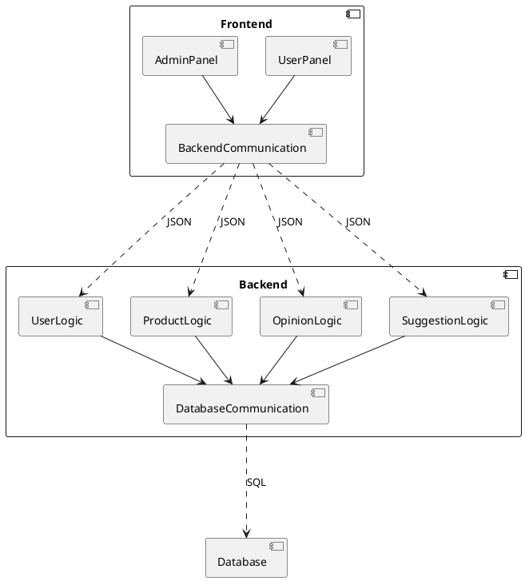
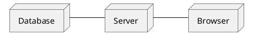
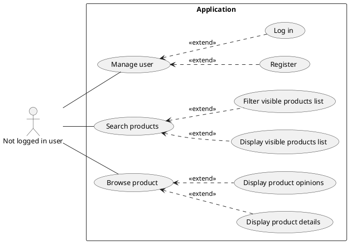
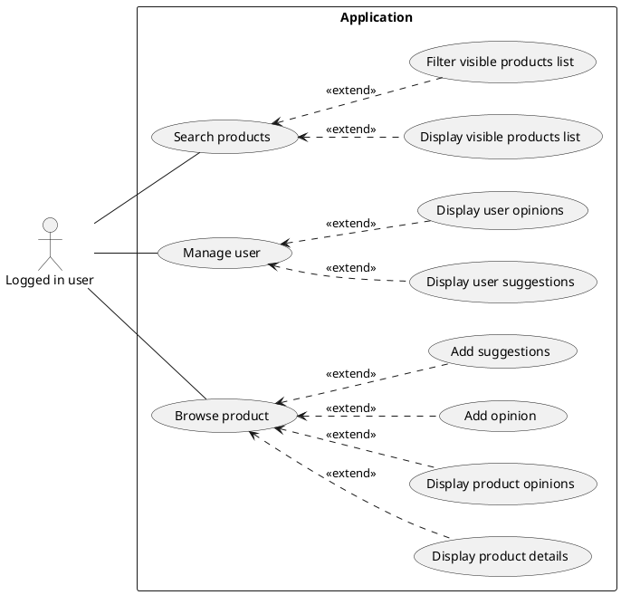
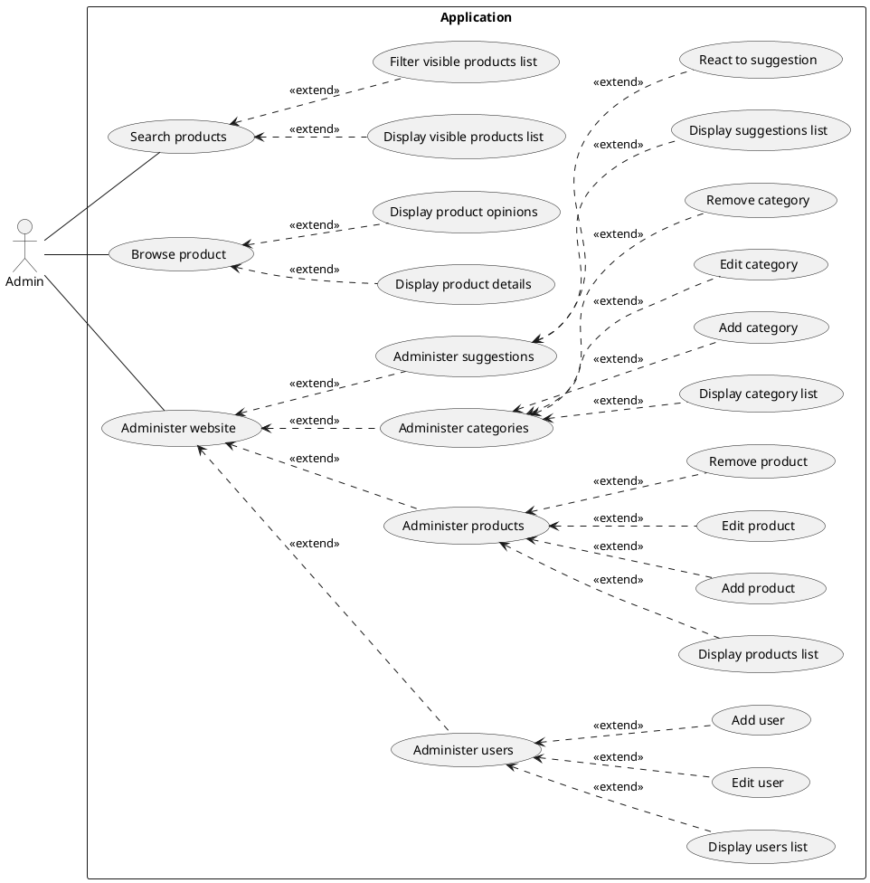

# System architecture

Designed with [PlantUML](https://plantuml.com/)

## Layers

```plantuml
@startuml
component Frontend {
    component UserPanel {
    }
    
    component AdminPanel {
    }
    
    component BackendCommunication {
    }
}

component Backend {
    component UserLogic {
    }
    component ProductLogic {
    }
    component OpinionLogic {
    }
    component SuggestionLogic {
    }
    
    component DatabaseCommunication {
    }
}

component Database {
}

DatabaseCommunication ...> Database: SQL

UserLogic             -->  DatabaseCommunication
ProductLogic          -->  DatabaseCommunication
OpinionLogic          -->  DatabaseCommunication
SuggestionLogic       -->  DatabaseCommunication

BackendCommunication  ...> UserLogic: JSON
BackendCommunication  ...> ProductLogic: JSON
BackendCommunication  ...> OpinionLogic: JSON
BackendCommunication  ...> SuggestionLogic: JSON

UserPanel             -->  BackendCommunication
AdminPanel            -->  BackendCommunication

@enduml 
```

## Deployment diagram

```plantuml
@startuml
left to right direction

node Database as database
node Server as server
node Browser as browser

database -- server
server -- browser

@enduml 
```

## Usages diagrams

### Not logged in user

```plantuml
@startuml

left to right direction

actor "Not logged in user" AS customer

rectangle Application {
    customer -- (Manage user)
    customer -- (Search products)
    customer -- (Browse product)
    
    (Manage user) <.. (Register): <<extend>>
    (Manage user) <.. (Log in): <<extend>>
    
    (Search products) <.. (Display visible products list): <<extend>>
    (Search products) <.. (Filter visible products list): <<extend>>
    
    (Browse product) <.. (Display product details): <<extend>>
    (Browse product) <.. (Display product opinions): <<extend>>
}

@enduml
```

### Logged in user

```plantuml
@startuml

left to right direction

actor "Logged in user" AS customer

rectangle Application {
    customer -- (Search products)
    customer -- (Manage user)
    customer -- (Browse product)
    
    (Search products) <.. (Display visible products list): <<extend>>
    (Search products) <.. (Filter visible products list): <<extend>>
    
    (Browse product) <.. (Display product details): <<extend>>
    (Browse product) <.. (Display product opinions): <<extend>>
    (Browse product) <.. (Add opinion): <<extend>>
    (Browse product) <.. (Add suggestions): <<extend>>
    
    (Manage user) <.. (Display user suggestions): <<extend>>
    (Manage user) <.. (Display user opinions): <<extend>>
}

@enduml
```

### Logged in admin user

```plantuml
@startuml

left to right direction

actor Admin AS admin

rectangle Application {
    admin -- (Search products)
    admin -- (Browse product)
    admin -- (Administer website)
    
    (Search products) <.. (Display visible products list): <<extend>>
    (Search products) <.. (Filter visible products list): <<extend>>
    
    (Browse product) <.. (Display product details): <<extend>>
    (Browse product) <.. (Display product opinions): <<extend>>
    
    (Administer website) <.. (Administer users): <<extend>>
    (Administer website) <.. (Administer products): <<extend>>
    (Administer website) <.. (Administer categories): <<extend>>
    (Administer website) <.. (Administer suggestions): <<extend>>
    
    (Administer users) <.. (Display users list): <<extend>>
    (Administer users) <.. (Edit user): <<extend>>
    (Administer users) <.. (Add user): <<extend>>
    
    (Administer products) <.. (Display products list): <<extend>>
    (Administer products) <.. (Add product): <<extend>>
    (Administer products) <.. (Edit product): <<extend>>
    (Administer products) <.. (Remove product): <<extend>>
    
    (Administer categories) <.. (Display category list): <<extend>>
    (Administer categories) <.. (Add category): <<extend>>
    (Administer categories) <.. (Edit category): <<extend>>
    (Administer categories) <.. (Remove category): <<extend>>
    
    (Administer suggestions) <.. (Display suggestions list): <<extend>>
    (Administer suggestions) <.. (React to suggestion): <<extend>>
}

@enduml
```