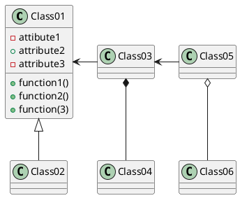

# Plant diagram
## Example UML Class Diagram

## Example Logic diagram
```plantuml
@startuml
Frontend -> "Backend" : Hello
"Backend" -> "Database" as Long
' You can also declare:
' "Backend" -> Long as "Database"
Long --> "Backend" : ok
@enduml
````
