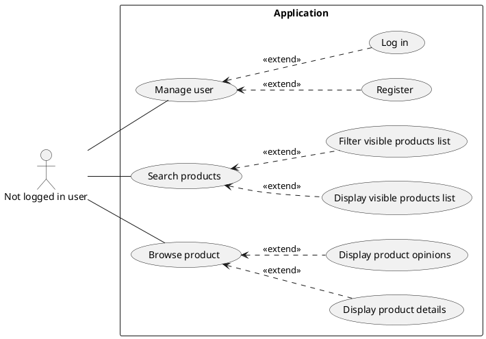
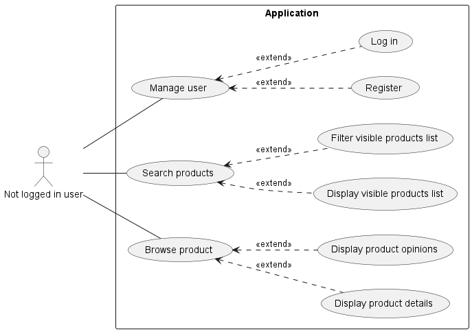
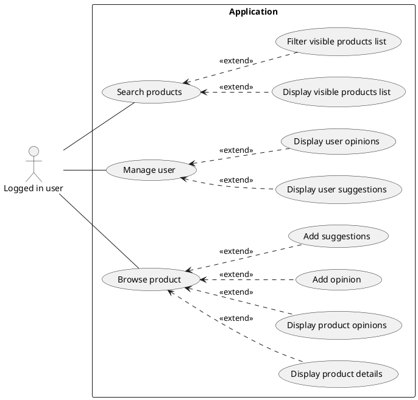
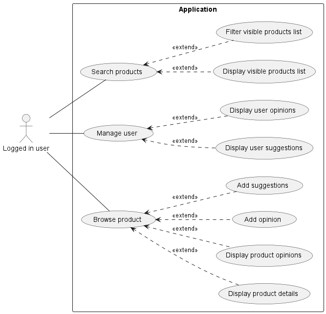
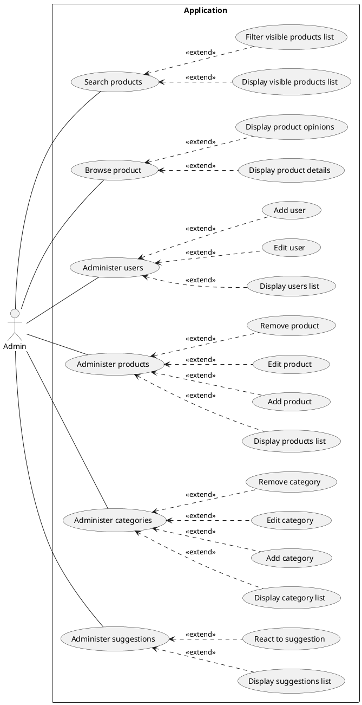
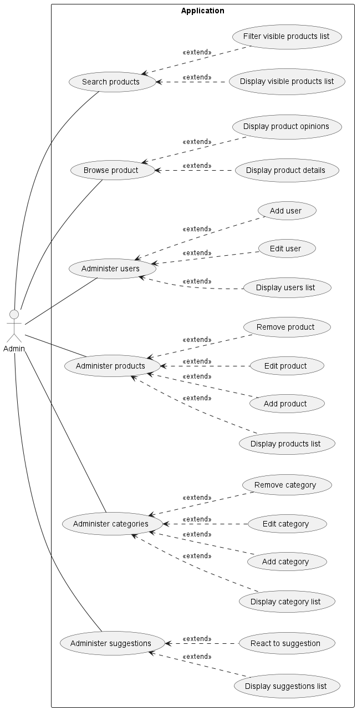

# Usages diagrams

## Not logged in user
<!--

```plantuml
@startuml

left to right direction

actor "Not logged in user" AS customer

rectangle Application {
    customer -- (Manage user)
    customer -- (Search products)
    customer -- (Browse product)
    
    (Manage user) <.. (Register): <<extend>>
    (Manage user) <.. (Log in): <<extend>>
    
    (Search products) <.. (Display visible products list): <<extend>>
    (Search products) <.. (Filter visible products list): <<extend>>
    
    (Browse product) <.. (Display product details): <<extend>>
    (Browse product) <.. (Display product opinions): <<extend>>
}

@enduml
```
-->

## Logged in user
<!--

```plantuml
@startuml

left to right direction

actor "Logged in user" AS customer

rectangle Application {
    customer -- (Search products)
    customer -- (Manage user)
    customer -- (Browse product)
    
    (Search products) <.. (Display visible products list): <<extend>>
    (Search products) <.. (Filter visible products list): <<extend>>
    
    (Browse product) <.. (Display product details): <<extend>>
    (Browse product) <.. (Display product opinions): <<extend>>
    (Browse product) <.. (Add opinion): <<extend>>
    (Browse product) <.. (Add suggestions): <<extend>>
    
    (Manage user) <.. (Display user suggestions): <<extend>>
    (Manage user) <.. (Display user opinions): <<extend>>
}

@enduml
```
-->

## Logged in admin user
<!--

```plantuml
@startuml

left to right direction

actor Admin AS admin

rectangle Application {
    admin -- (Search products)
    admin -- (Browse product)
    admin --  (Administer users)
    admin --  (Administer products)
    admin --  (Administer categories)
    admin --  (Administer suggestions)
    
    (Search products) <.. (Display visible products list): <<extend>>
    (Search products) <.. (Filter visible products list): <<extend>>
    
    (Browse product) <.. (Display product details): <<extend>>
    (Browse product) <.. (Display product opinions): <<extend>>
    
    (Administer users) <.. (Display users list): <<extend>>
    (Administer users) <.. (Edit user): <<extend>>
    (Administer users) <.. (Add user): <<extend>>
    
    (Administer products) <.. (Display products list): <<extend>>
    (Administer products) <.. (Add product): <<extend>>
    (Administer products) <.. (Edit product): <<extend>>
    (Administer products) <.. (Remove product): <<extend>>
    
    (Administer categories) <.. (Display category list): <<extend>>
    (Administer categories) <.. (Add category): <<extend>>
    (Administer categories) <.. (Edit category): <<extend>>
    (Administer categories) <.. (Remove category): <<extend>>
    
    (Administer suggestions) <.. (Display suggestions list): <<extend>>
    (Administer suggestions) <.. (React to suggestion): <<extend>>
}

@enduml
```
-->

