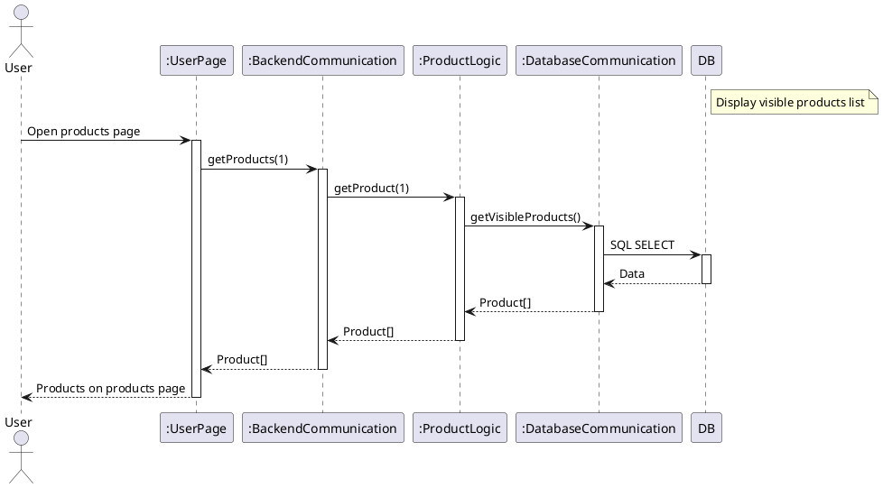

## Sequence diagram for Display visible products list

```plantuml
@startuml
    note right of DB
    Display visible products list
    endnote
    
    actor       User
    participant ":UserPage"              as UserFE
    participant ":BackendCommunication"  as BeComm
    participant ":ProductLogic"          as Product
    participant ":DatabaseCommunication" as DbComm
    participant ":Database"              as DB
    
    User    -> UserFE  : Open products page
    activate UserFE
    UserFE  -> BeComm  : getProducts(1)
    activate BeComm
    BeComm  -> Product : getProduct(1)
    activate Product
    Product -> DbComm  : getVisibleProducts()
    activate DbComm
    DbComm  -> DB      : SQL SELECT
    activate DB
    
    return Data
    return Product[]
    return Product[]
    return Product[]
    return Products on products page
    
@enduml
```