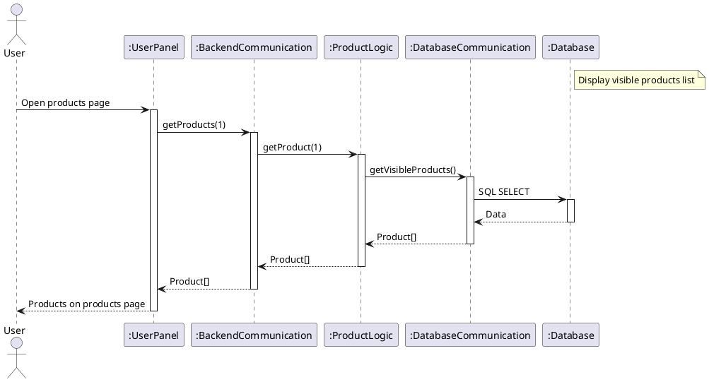
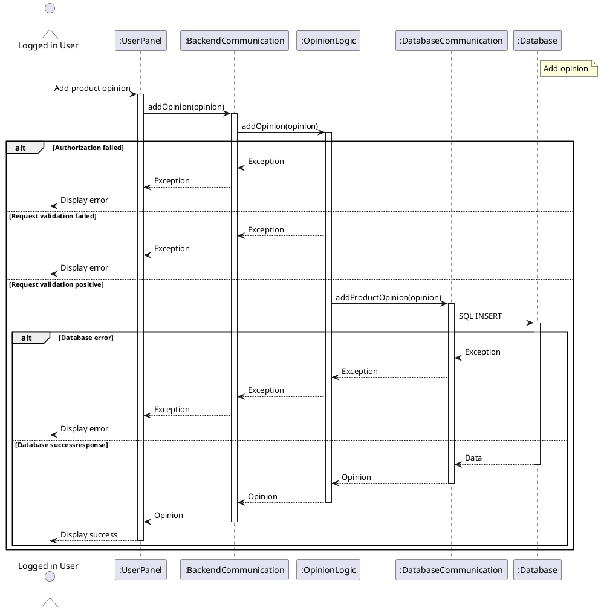

# Main functionalities diagrams
## Sequence diagram for Display visible products list

```plantuml
@startuml
    note right of ":Database"
        Display visible products list
    endnote
    
    actor       User
    participant ":UserPanel"             as UserFE
    participant ":BackendCommunication"  as BeComm
    participant ":ProductLogic"          as Product
    participant ":DatabaseCommunication" as DbComm
    participant ":Database"
    
    User    -> UserFE  : Open products page
    activate UserFE
    UserFE  -> BeComm  : getProducts(1)
    activate BeComm
    BeComm  -> Product : getProduct(1)
    activate Product
    Product -> DbComm  : getVisibleProducts()
    activate DbComm
    DbComm  -> ":Database"      : SQL SELECT
    activate ":Database"
    
    return Data
    return Product[]
    return Product[]
    return Product[]
    return Products on products page
    
@enduml
```
## Sequence diagram for Add opinion

```plantuml
```plantuml
@startuml
    note right of ":Database"
        Add opinion
    endnote
    
    actor       "Logged in User" as User
    participant ":UserPanel"             as UserFE
    participant ":BackendCommunication"  as BeComm
    participant ":OpinionLogic"          as Opinion
    participant ":DatabaseCommunication" as DbComm
    participant ":Database"
    
    User    -> UserFE  : Add product opinion
    activate UserFE
    UserFE  -> BeComm  : addOpinion(opinion)
    activate BeComm
    BeComm  -> Opinion : addOpinion(opinion)
    activate Opinion
    alt Authorization failed
        Opinion --> BeComm : Exception
        BeComm --> UserFE : Exception
        UserFE --> User   : Display error
    else Request validation failed
        Opinion --> BeComm : Exception
        BeComm --> UserFE : Exception
        UserFE --> User   : Display error
    else Request validation positive
        Opinion -> DbComm  : addProductOpinion(opinion)
        activate DbComm
        DbComm  -> ":Database"      : SQL INSERT
        activate ":Database"
        alt Database error
            ":Database" --> DbComm      : Exception
            DbComm --> Opinion : Exception
            Opinion --> BeComm : Exception
            BeComm --> UserFE  : Exception
            UserFE --> User    : Display error
        else Database successresponse
            ":Database" --> DbComm      : Data
            deactivate ":Database"
            DbComm --> Opinion : Opinion
            deactivate DbComm
            Opinion --> BeComm : Opinion
            deactivate Opinion
            BeComm --> UserFE  : Opinion
            deactivate BeComm
            UserFE --> User    : Display success
            deactivate UserFE
        end
    end
    
@enduml
```