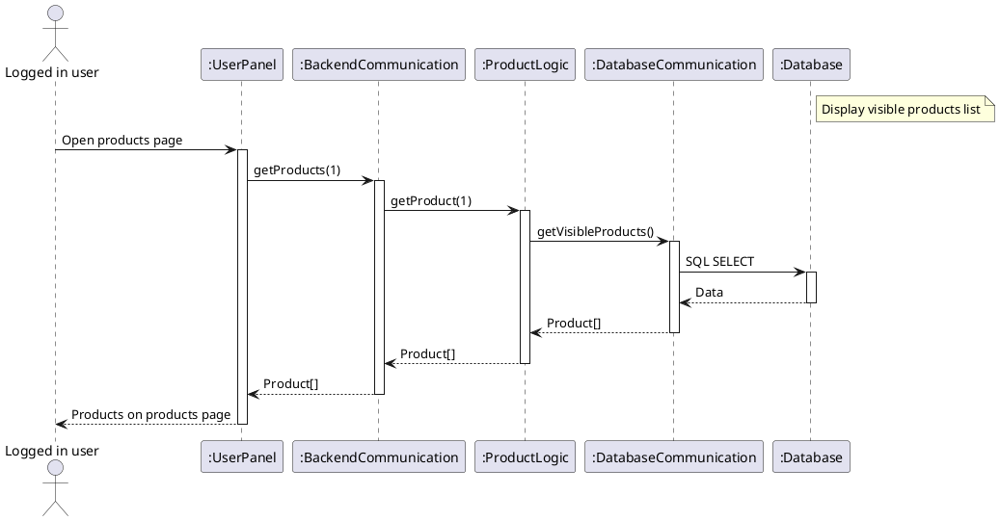
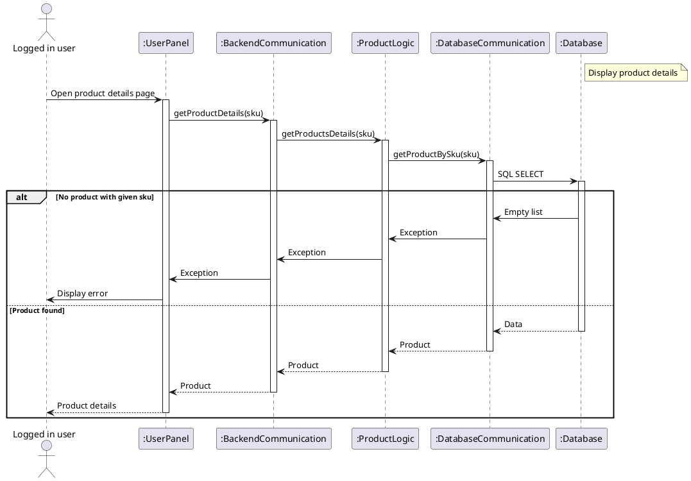
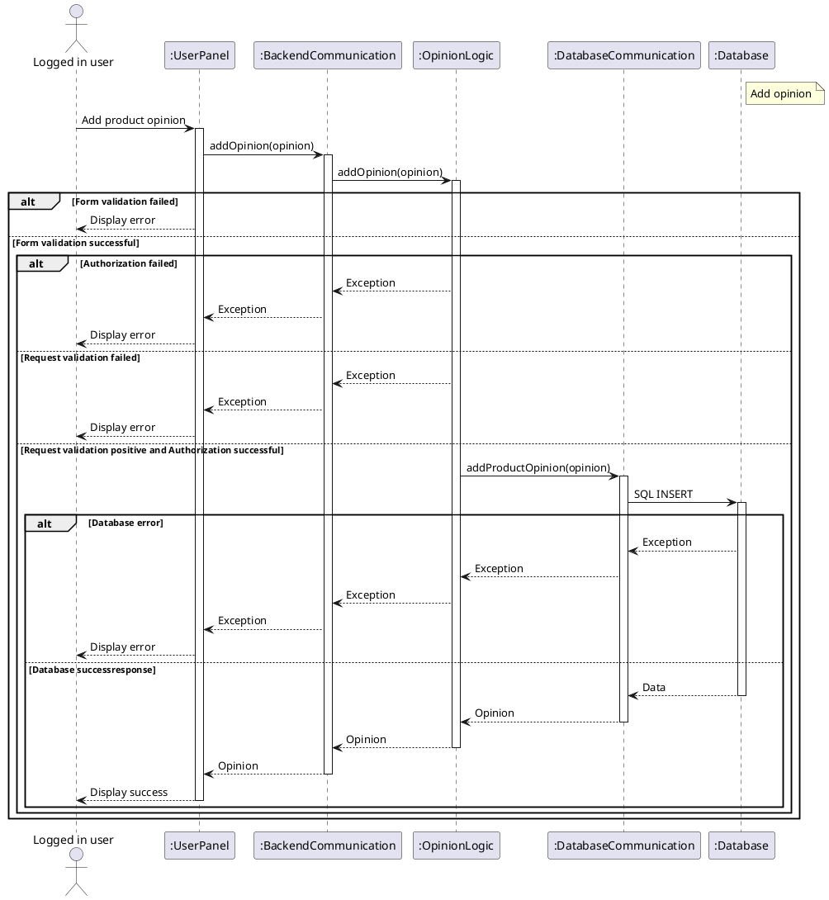
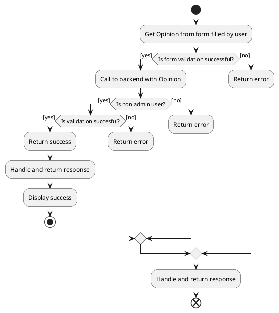
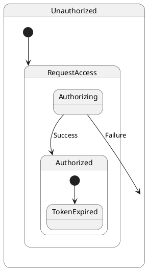

# Main functionalities diagrams
## Sequence diagram for Display visible products list

## Sequence diagram for Display product details

## Sequence diagram for Add opinion

## Activity diagram for add opinion


## State machine diagram


## Interaction overview diagram

```plantuml
@startuml
Start

:Display visible products list
{{
    actor       User
    participant ":UserPanel"             as UserFE
    participant ":BackendCommunication"  as BeComm
    participant ":ProductLogic"          as Product
    participant ":DatabaseCommunication" as DbComm
    participant ":Database"
    
    User    -> UserFE      : Open product details page
    activate UserFE
    UserFE  -> BeComm      : getProductDetails(sku)
    activate BeComm
    BeComm  -> Product     : getProductsDetails(sku)
    activate Product
    Product -> DbComm      : getProductBySku(sku)
    activate DbComm
    DbComm  -> ":Database" : SQL SELECT
    activate ":Database"
    alt No product with given sku
        ":Database" -> DbComm : Empty list
        DbComm  -> Product    : Exception
        Product -> BeComm     : Exception
        BeComm  -> UserFE     : Exception
        UserFE  -> User       : Display error
    else Product found
        return Data
        return Product
        return Product
        return Product
        return Product details
    end
}}
;

:Display product details
{{
    actor       User
    participant ":UserPanel"             as UserFE
    participant ":BackendCommunication"  as BeComm
    participant ":ProductLogic"          as Product
    participant ":DatabaseCommunication" as DbComm
    participant ":Database"
    
    User    -> UserFE      : Open product details page
    activate UserFE
    UserFE  -> BeComm      : getProductDetails(sku)
    activate BeComm
    BeComm  -> Product     : getProductsDetails(sku)
    activate Product
    Product -> DbComm      : getProductBySku(sku)
    activate DbComm
    DbComm  -> ":Database" : SQL SELECT
    activate ":Database"
    alt No product with given sku
        ":Database" -> DbComm : Empty list
        DbComm  -> Product    : Exception
        Product -> BeComm     : Exception
        BeComm  -> UserFE     : Exception
        UserFE  -> User       : Display error
    else Product found
        return Data
        return Product
        return Product
        return Product
        return Product details
    end
}}
;

:Add opinion
{{
    actor       "Logged in User" as User
    participant ":UserPanel"             as UserFE
    participant ":BackendCommunication"  as BeComm
    participant ":OpinionLogic"          as Opinion
    participant ":DatabaseCommunication" as DbComm
    participant ":Database"
    
    User    -> UserFE              : Add product opinion
    activate UserFE
    UserFE  -> BeComm              : addOpinion(opinion)
    activate BeComm
    BeComm  -> Opinion             : addOpinion(opinion)
    activate Opinion
    alt Authorization failed
        Opinion --> BeComm         : Exception
        BeComm --> UserFE          : Exception
        UserFE --> User            : Display error
    else Request validation failed
        Opinion --> BeComm         : Exception
        BeComm --> UserFE          : Exception
        UserFE --> User            : Display error
    else Request validation positive
        Opinion -> DbComm          : addProductOpinion(opinion)
        activate DbComm
        DbComm  -> ":Database"     : SQL INSERT
        activate ":Database"
        alt Database error
            ":Database" --> DbComm : Exception
            DbComm --> Opinion     : Exception
            Opinion --> BeComm     : Exception
            BeComm --> UserFE      : Exception
            UserFE --> User        : Display error
        else Database successresponse
            ":Database" --> DbComm : Data
            deactivate ":Database"
            DbComm --> Opinion     : Opinion
            deactivate DbComm
            Opinion --> BeComm     : Opinion
            deactivate Opinion
            BeComm --> UserFE      : Opinion
            deactivate BeComm
            UserFE --> User        : Display success
            deactivate UserFE
        end
    end
}}
;
Stop
@enduml
```



## Structural diagram for Product parts
```plantuml
card Product {
    card sku
    card name
    card description
    card opinionAvg
    card pictureUrl
    card visible
    card user
    
    card category
    card opinion
    card suggestion
}
sku "1" -- "1" name
sku "1" -- "1" description
sku "1" -- "1" opinionAvg
sku "1" -- "1" pictureUrl
sku "1" -- "1" visible
sku "1" -- "1" user

sku "1" -- "0..*" category
sku "1" -- "0..*" opinion
sku "1" -- "0..*" suggestion
```