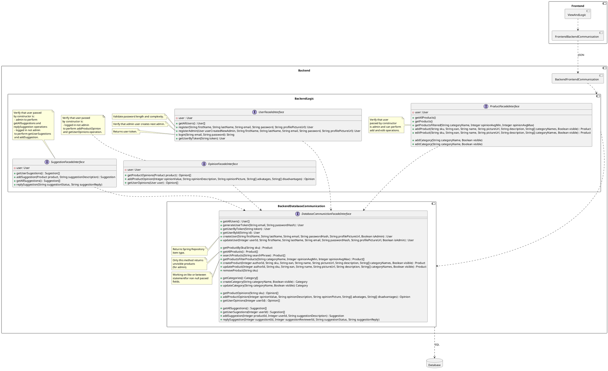

# Layers

```plantuml
@startuml
component Frontend {
    component ViewAndLogic {
    }
    
    component FrontendBackendCommunication {
    }
}

component Backend {
    component BackendFrontendCommunication {
    }
    
    component BackendLogic {
        interface UserFacadeInterface {
            - user : User
            + getAllUsers() : User[]
            + register(String firstName, String lastName, String email, String password, String profilePictureUrl): User
            + registerAdmin(User userCreatedNewAdmin, String firstName, String lastName, String email, String password, String profilePictureUrl): User
            + login(String email, String password): String
            + getUserByToken(String token): User
        }
    
        note left of UserFacadeInterface::register
            Validate password length and complexity.
        endnote
    
        note left of UserFacadeInterface::registerAdmin
            Verify that admin user creates next admin.
        endnote
    
        note left of UserFacadeInterface::login
            Returns user token.
        endnote
        
        interface ProductFacadeInterface {
            - user: User
            + getAllProducts()
            + getProducts()
            + getProductsFiltered(String categoryName, Integer opinionAvgMin, Integer opinionAvgMax)
            + addProduct(String sku, String ean, String name, String pictureUrl, String description, String[] categoryNames, Boolean visible) : Product
            + editProduct(String sku, String ean, String name, String pictureUrl, String description, String[] categoryNames, Boolean visible) : Product
            
            + addCategory(String categoryName, Boolean visible)
            + editCategory(String categoryName, Boolean visible)
        }
    
        note left of ProductFacadeInterface
            Verify that user
            passed by constructor
            is admin and can perform
            add and edit operations.
        endnote
        
        interface SuggestionFacadeInterface {
            - user: User
            + getUserSugestions() : Sugestion[]
            + addSuggestion(Product product, String suggestionDescription) : Suggestion
            + getAllSuggestions() : Suggestion[]
            + replySuggestion(String suggestionStatus, String suggestionReply)
        }
    
        note top of SuggestionFacadeInterface
            Verify that user passed
            by constructor is:
             - admin to perform 
            getAllSuggestions and
            replySuggestion operations
             - logged in not admin
             to perform getUserSugestions
             and addSuggestion.
        endnote
        
        
        interface OpinionFacadeInterface {
            - user: User
            + getProductOpinions(Product product) : Opinion[]
            + addProductOpinion(Integer opinionValue, String opinionDescription, String opinionPicture, String[] advatages, String[] disadvantages) : Opinion
            + getUserOpinions(User user) : Opinion[]
        }
    
        note top of OpinionFacadeInterface
            Verify that user passed
            by constructor is:
             - logged in not admin
             to perform addProductOpinion
             and getUserOpinions operation.
        endnote
    }
    
    component BackendDatabaseCommunication {
        interface DatabaseCommunictionFacadeInterface {
            + getAllUsers() : User[]
            + generateUserToken(String email, String passwordHash) : User
            + getUserByToken(String token) : User
            + getUserById(String id) : User
            + createUser(String firstName, String lastName, String email, String passwordHash, String profilePictureUrl, Boolean isAdmin) : User
            + updateUser(Integer userId, String firstName, String lastName, String email, String passwordHash, String profilePictureUrl, Boolean isAdmin) : User
            
            + getProductBySku(String sku) : Product
            + getAllProducts() : Product[]
            + searchProducts(String searchPhrase) : Product[]
            + getProductsFilterProducts(String categoryName, Integer opinionAvgMin, Integer opinionAvgMax) : Product[]
            + createProduct(Integer authorId, String sku, String ean, String name, String pictureUrl, String description, String[] categoryNames, Boolean visible) : Product
            + updateProduct(Integer authorId, String sku, String ean, String name, String pictureUrl, String description, String[] categoryNames, Boolean visible) : Product
            + removeProduct(String sku)
            
            + getCategories(): Category[]
            + createCategory(String categoryName, Boolean visible) : Category
            + updateCategory(String categoryName, Boolean visible): Category
            
            + getProductOpinions(String sku) : Opinion[]
            + addProductOpinion(Integer opinionValue, String opinionDescription, String opinionPicture, String[] advatages, String[] disadvantages) : Opinion
            + getUserOpinions(Integer userId) : Opinion[]
            
            + getAllSuggestions() : Suggestion[]
            + getUserSugestions(Integer userId) : Sugestion[]
            + addSuggestion(Integer productId, Integer userId, String suggestionDescription) : Suggestion
            + replySuggestion(Integer suggestiontId, Integer suggestionReviewerId, String suggestionStatus, String suggestionReply)
        }
        
        note left of DatabaseCommunictionFacadeInterface::createUser
            Returns Spring Repository
            item type.
        endnote
        
        note left of DatabaseCommunictionFacadeInterface::getAllProducts
            Only this method returns 
            unvisible products
            (for admin).
        endnote
        
        note left of DatabaseCommunictionFacadeInterface::getProductsFilterProducts
            Working on like or between 
            statementfor non null passed 
            fields.
        endnote
    }
    
    UserFacadeInterface       ..> DatabaseCommunictionFacadeInterface
    ProductFacadeInterface    ..> DatabaseCommunictionFacadeInterface
    SuggestionFacadeInterface ..> DatabaseCommunictionFacadeInterface
    OpinionFacadeInterface    ..> DatabaseCommunictionFacadeInterface
}

database Database {
}

BackendDatabaseCommunication ...> Database: SQL
BackendLogic                 ..>  BackendDatabaseCommunication
BackendFrontendCommunication ..>  BackendLogic
FrontendBackendCommunication ...> BackendFrontendCommunication: JSON
ViewAndLogic                 ..>  FrontendBackendCommunication

@enduml 
```