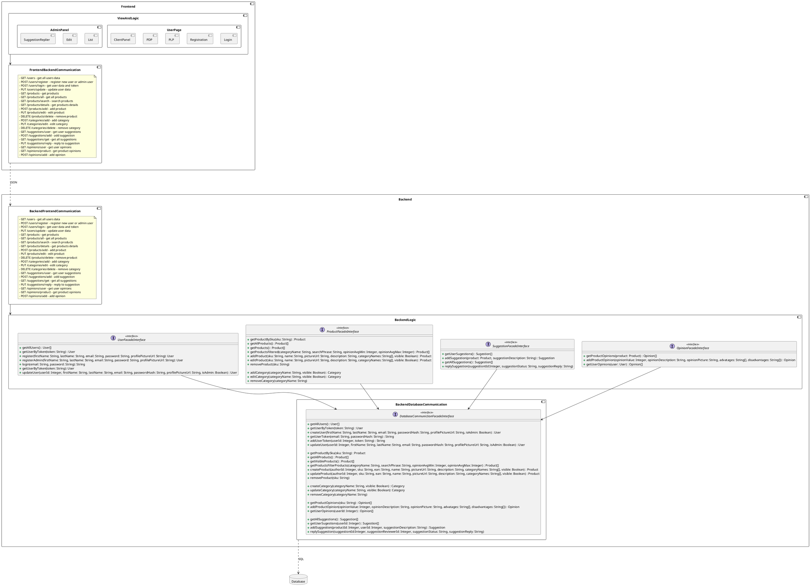

# Layers

```plantuml
@startuml
component Frontend {
    component ViewAndLogic {
        component UserPage {
            component Login {
            }
            component Registration {
            }
            component PLP {
            }
            component PDP {
            }
            component ClientPanel{
            }
        }
        component AdminPanel {
            component List {
            }
            component Edit {
            }
            component SuggestionReplier {
            }
        }
    }
    
    component FrontendBackendCommunication {
        note as Description1
            - GET /users - get all users data
            - POST /users/register - register new user or admin user
            - POST /users/login - get user data and token
            - PUT /users/update - update user data
            - GET /products - get products
            - GET /products/all - get all products
            - GET /products/search - search products
            - GET /products/details - get products details
            - POST /products/add - add product
            - PUT /products/edit - edit product
            - DELETE /products/delete - remove product
            - POST /categories/add - add category
            - PUT /categories/edit - edit category
            - DELETE /categories/delete - remove category
            - GET /suggestions/user - get user suggestions
            - POST /suggestions/add - add suggestion
            - GET /suggestions/get - get all suggestions
            - PUT /suggestions/reply - reply to suggestion
            - GET /opinions/user - get user opinions
            - GET /opinions/product - get product opinions
            - POST /opinions/add - add opinion
        endnote
    }
}

component Backend {    
    component BackendFrontendCommunication {
        note as Description2
            - GET /users - get all users data
            - POST /users/register - register new user or admin user
            - POST /users/login - get user data and token
            - PUT /users/update - update user data
            - GET /products - get products
            - GET /products/all - get all products
            - GET /products/search - search products
            - GET /products/details - get products details
            - POST /products/add - add product
            - PUT /products/edit - edit product
            - DELETE /products/delete - remove product
            - POST /categories/add - add category
            - PUT /categories/edit - edit category
            - DELETE /categories/delete - remove category
            - GET /suggestions/user - get user suggestions
            - POST /suggestions/add - add suggestion
            - GET /suggestions/get - get all suggestions
            - PUT /suggestions/reply - reply to suggestion
            - GET /opinions/user - get user opinions
            - GET /opinions/product - get product opinions
            - POST /opinions/add - add opinion
        endnote
    }
    
    component BackendLogic {
        interface UserFacadeInterface <<interface>> {
            + getAllUsers() : User[]
            + getUserByToken(token: String) : User
            + register(firstName: String, lastName: String, email: String, password: String, profilePictureUrl: String): User
            + registerAdmin(firstName: String, lastName: String, email: String, password: String, profilePictureUrl: String): User
            + login(email: String, password: String): String
            + getUserByToken(token: String): User
            + updateUser(userId: Integer, firstName: String, lastName: String, email: String, passwordHash: String, profilePictureUrl: String, isAdmin: Boolean) : User
        }
        interface ProductFacadeInterface <<interface>> {
            + getProductBySku(sku: String) : Product
            + getAllProducts() : Product[]
            + getProducts() : Product[]
            + getProductsFiltered(categoryName: String, searchPhrase: String, opinionAvgMin: Integer, opinionAvgMax: Integer) : Product[]
            + addProduct(sku: String, name: String, pictureUrl: String, description: String, categoryNames: String[], visible: Boolean) : Product
            + editProduct(sku: String, name: String, pictureUrl: String, description: String, categoryNames: String[], visible: Boolean) : Product
            + removeProduct(sku: String)
            
            + addCategory(categoryName: String, visible: Boolean) : Category
            + editCategory(categoryName: String, visible: Boolean) : Category
            + removeCategory(categoryName: String)
        }
        interface SuggestionFacadeInterface <<interface>> {
            + getUserSugestions() : Sugestion[]
            + addSuggestion(product: Product, suggestionDescription: String) : Suggestion
            + getAllSuggestions() : Suggestion[]
            + replySuggestion(suggestiontId:Integer, suggestionStatus: String, suggestionReply: String)
        }
        interface OpinionFacadeInterface <<interface>> {
            + getProductOpinions(product: Product) : Opinion[]
            + addProductOpinion(opinionValue: Integer, opinionDescription: String, opinionPicture: String, advatages: String[], disadvantages: String[]) : Opinion
            + getUserOpinions(user: User) : Opinion[]
        }
    }
    
    component BackendDatabaseCommunication {
        interface DatabaseCommunictionFacadeInterface <<interface>> {
            + getAllUsers() : User[]
            + getUserByToken(token: String) : User
            + createUser(firstName: String, lastName: String, email: String, passwordHash: String, profilePictureUrl: String, isAdmin: Boolean) : User
            + getUserToken(email: String, passwordHash: String) : String
            + addUserToken(userId: Integer, token: String) : String
            + updateUser(userId: Integer, firstName: String, lastName: String, email: String, passwordHash: String, profilePictureUrl: String, isAdmin: Boolean) : User
        
            + getProductBySku(sku: String) : Product
            + getAllProducts() : Product[]
            + getVisibleProducts() : Product[]
            + getProductsFilterProducts(categoryName: String, searchPhrase: String, opinionAvgMin: Integer, opinionAvgMax: Integer) : Product[]
            + createProduct(authorId: Integer, sku: String, ean: String, name: String, pictureUrl: String, description: String, categoryNames: String[], visible: Boolean) : Product
            + updateProduct(authorId: Integer, sku: String, ean: String, name: String, pictureUrl: String, description: String, categoryNames: String[], visible: Boolean) : Product
            + removeProduct(sku: String)

            + createCategory(categoryName: String, visible: Boolean) : Category
            + updateCategory(categoryName: String, visible: Boolean): Category
            + removeCategory(categoryName: String)
            
            + getProductOpinions(sku: String) : Opinion[]
            + addProductOpinion(opinionValue: Integer, opinionDescription: String, opinionPicture: String, advatages: String[], disadvantages: String[]) : Opinion
            + getUserOpinions(userId: Integer) : Opinion[]
            
            + getAllSuggestions() : Suggestion[]
            + getUserSugestions(userId: Integer) : Sugestion[]
            + addSuggestion(productId: Integer, userId: Integer, suggestionDescription: String) : Suggestion
            + replySuggestion(suggestiontId:Integer, suggestionReviewerId: Integer, suggestionStatus: String, suggestionReply: String)
        }
    }
    
    UserFacadeInterface -->  DatabaseCommunictionFacadeInterface
    ProductFacadeInterface  --> DatabaseCommunictionFacadeInterface
    SuggestionFacadeInterface  --> DatabaseCommunictionFacadeInterface
    OpinionFacadeInterface  --> DatabaseCommunictionFacadeInterface
}

database Database {
}

BackendDatabaseCommunication ...> Database: SQL
BackendFrontendCommunication -->  BackendLogic
FrontendBackendCommunication ...> BackendFrontendCommunication: JSON
ViewAndLogic                 -->  FrontendBackendCommunication
@enduml 
```