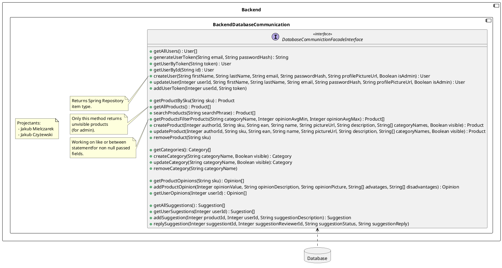

# Backend - Database Communication

```plantuml
@startuml

database Database {
}
component Backend {
    component BackendDatabaseCommunication {
        note as Authors
            Projectants: 
             - Jakub Mielczarek
             - Jakub Czyżewski
        endnote
        interface DatabaseCommunictionFacadeInterface <<interface>> {
            + getAllUsers() : User[]
            + generateUserToken(String email, String passwordHash) : String
            + getUserByToken(String token) : User
            + getUserById(String id) : User
            + createUser(String firstName, String lastName, String email, String passwordHash, String profilePictureUrl, Boolean isAdmin) : User
            + updateUser(Integer userId, String firstName, String lastName, String email, String passwordHash, String profilePictureUrl, Boolean isAdmin) : User
            + addUserToken(Integer userId, String token)
            
            + getProductBySku(String sku) : Product
            + getAllProducts() : Product[]
            + searchProducts(String searchPhrase) : Product[]
            + getProductsFilterProducts(String categoryName, Integer opinionAvgMin, Integer opinionAvgMax) : Product[]
            + createProduct(Integer authorId, String sku, String ean, String name, String pictureUrl, String description, String[] categoryNames, Boolean visible) : Product
            + updateProduct(Integer authorId, String sku, String ean, String name, String pictureUrl, String description, String[] categoryNames, Boolean visible) : Product
            + removeProduct(String sku)
            
            + getCategories(): Category[]
            + createCategory(String categoryName, Boolean visible) : Category
            + updateCategory(String categoryName, Boolean visible): Category
            + removeCategory(String categoryName)
            
            + getProductOpinions(String sku) : Opinion[]
            + addProductOpinion(Integer opinionValue, String opinionDescription, String opinionPicture, String[] advatages, String[] disadvantages) : Opinion
            + getUserOpinions(Integer userId) : Opinion[]
            
            + getAllSuggestions() : Suggestion[]
            + getUserSugestions(Integer userId) : Sugestion[]
            + addSuggestion(Integer productId, Integer userId, String suggestionDescription) : Suggestion
            + replySuggestion(Integer suggestiontId, Integer suggestionReviewerId, String suggestionStatus, String suggestionReply)
        }
        note left of DatabaseCommunictionFacadeInterface::createUser
            Returns Spring Repository
            item type.
        endnote
        
        note left of DatabaseCommunictionFacadeInterface::getAllProducts
            Only this method returns 
            unvisible products
            (for admin).
        endnote
        
        note left of DatabaseCommunictionFacadeInterface::getProductsFilterProducts
            Working on like or between 
            statementfor non null passed 
            fields.
        endnote
    }
}

DatabaseCommunictionFacadeInterface <.. Database

@enduml 
```