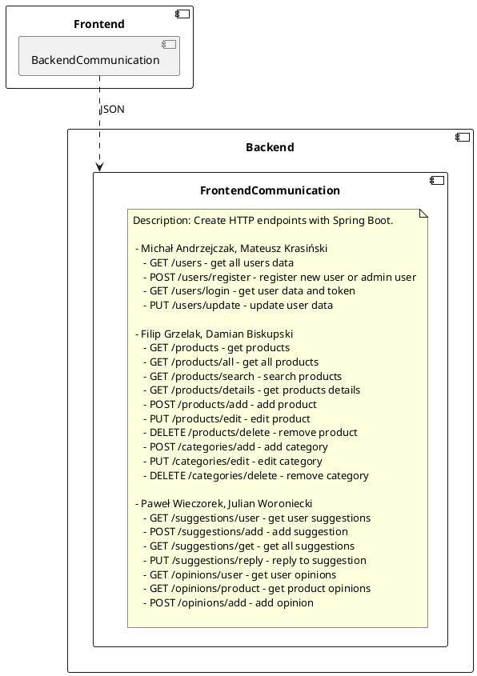

# Backend - Frontend Communication

```plantuml
@startuml
    
component Frontend {
    
    component BackendCommunication {
    }
}

component Backend {
    component FrontendCommunication {
        note as Description
            Description: Create HTTP endpoints with Spring Boot.
            
             - Michał Andrzejczak, Mateusz Krasiński
                - GET /users - get all users data
                - POST /users/register - register new user or admin user
                - GET /users/login - get user data and token
                - PUT /users/update - update user data
                
             - Filip Grzelak, Damian Biskupski
                - GET /products - get products
                - GET /products/all - get all products
                - GET /products/search - search products
                - GET /products/details - get products details
                - POST /products/add - add product
                - PUT /products/edit - edit product
                - DELETE /products/delete - remove product
                - POST /categories/add - add category
                - PUT /categories/edit - edit category
                - DELETE /categories/delete - remove category
                
             - Paweł Wieczorek, Julian Woroniecki
                - GET /suggestions/user - get user suggestions
                - POST /suggestions/add - add suggestion
                - GET /suggestions/get - get all suggestions
                - PUT /suggestions/reply - reply to suggestion
                - GET /opinions/user - get user opinions
                - GET /opinions/product - get product opinions
                - POST /opinions/add - add opinion
                
        endnote
    }
}

BackendCommunication ..> FrontendCommunication: JSON

@enduml 
```