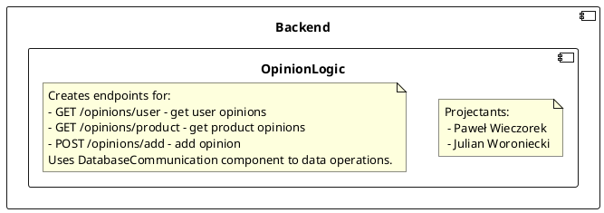

## Opinion

```plantuml
@startuml
component Backend {
    component OpinionLogic {
        note as Authors
            Projectants: 
             - Paweł Wieczorek
             - Julian Woroniecki
        endnote
        note as Description
            Creates endpoints for:
            - GET /opinions/user - get user opinions
            - GET /opinions/product - get product opinions
            - POST /opinions/add - add opinion
            Uses DatabaseCommunication component to data operations.
        endnote
    }
}
@enduml 
```