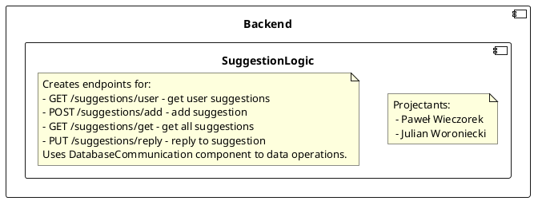
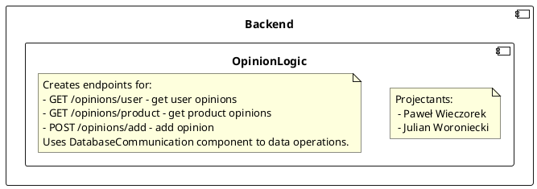
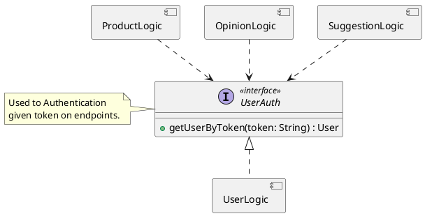

## Suggestion

```plantuml
@startuml
component Backend {
    component SuggestionLogic {
        note as Authors
            Projectants: 
             - Paweł Wieczorek
             - Julian Woroniecki
        endnote
        note as Description
            Creates endpoints for:
            - GET /suggestions/user - get user suggestions
            - POST /suggestions/add - add suggestion
            - GET /suggestions/get - get all suggestions
            - PUT /suggestions/reply - reply to suggestion
            Uses DatabaseCommunication component to data operations.
        endnote
}
@enduml 
```

## Opinion

```plantuml
@startuml
component Backend {
    component OpinionLogic {
        note as Authors
            Projectants: 
             - Paweł Wieczorek
             - Julian Woroniecki
        endnote
        note as Description
            Creates endpoints for:
            - GET /opinions/user - get user opinions
            - GET /opinions/product - get product opinions
            - POST /opinions/add - add opinion
            Uses DatabaseCommunication component to data operations.
        endnote
    }
}
@enduml 
```

## Backend logic interface communication

```plantuml
@startuml
    component UserLogic {
    }
    component ProductLogic {
    }
    component OpinionLogic {
    }
    component SuggestionLogic {
    }
    
    interface UserAuth <<interface>> {
        + getUserByToken(token: String) : User
    }
    
    note left of UserAuth
        Used to Authentication
        given token on endpoints.
    endnote
    
    ProductLogic    ..>  UserAuth
    OpinionLogic    ..>  UserAuth
    SuggestionLogic ..>  UserAuth
    UserAuth      <|.. UserLogic
@enduml 
```