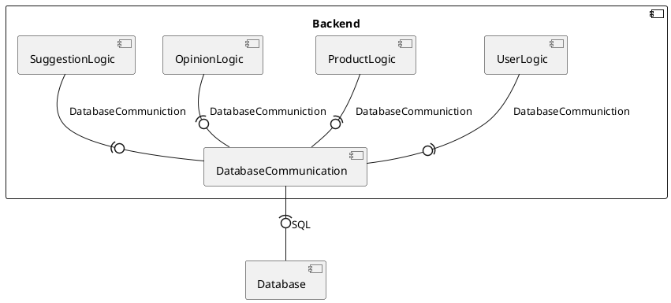
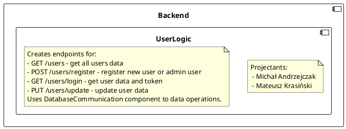
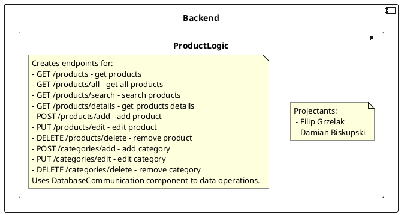
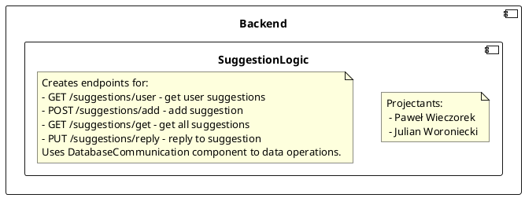
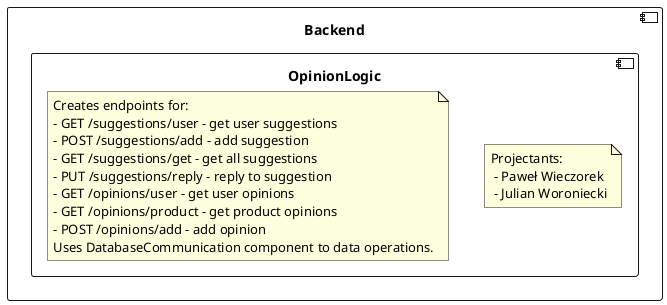
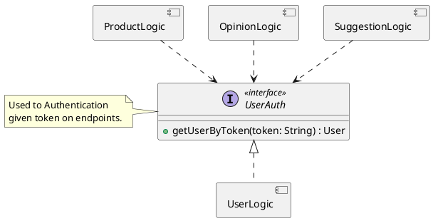

# Backend logic layer

```plantuml
@startuml
component Backend {
    component UserLogic {
    }
    component ProductLogic {
    }
    component OpinionLogic {
    }
    component SuggestionLogic {
    }
    
    component DatabaseCommunication {
    }
}

component Database {
}

DatabaseCommunication -(0-  Database : SQL

UserLogic             -(0-  DatabaseCommunication : DatabaseCommuniction
ProductLogic          -(0-  DatabaseCommunication : DatabaseCommuniction
OpinionLogic          -(0-  DatabaseCommunication : DatabaseCommuniction
SuggestionLogic       -(0-  DatabaseCommunication : DatabaseCommuniction
@enduml 
```

## User

```plantuml
@startuml
component Backend {
    component UserLogic {
        note as Authors
            Projectants: 
             - Michał Andrzejczak
             - Mateusz Krasiński
        endnote
        note as Description
            Creates endpoints for:
            - GET /users - get all users data
            - POST /users/register - register new user or admin user
            - GET /users/login - get user data and token
            - PUT /users/update - update user data
            Uses DatabaseCommunication component to data operations.
        endnote
        
    }
}
@enduml 
```

## Product

```plantuml
@startuml
component Backend {    
    component ProductLogic {
        note as Authors
            Projectants: 
             - Filip Grzelak
             - Damian Biskupski
        endnote
        note as Description
            Creates endpoints for:
            - GET /products - get products
            - GET /products/all - get all products
            - GET /products/search - search products
            - GET /products/details - get products details
            - POST /products/add - add product
            - PUT /products/edit - edit product
            - DELETE /products/delete - remove product
            - POST /categories/add - add category
            - PUT /categories/edit - edit category
            - DELETE /categories/delete - remove category
            Uses DatabaseCommunication component to data operations.
        endnote
    }
}
@enduml 
```

## Suggestion

```plantuml
@startuml
component Backend {
    component SuggestionLogic {
        note as Authors
            Projectants: 
             - Paweł Wieczorek
             - Julian Woroniecki
        endnote
        note as Description
            Creates endpoints for:
            - GET /suggestions/user - get user suggestions
            - POST /suggestions/add - add suggestion
            - GET /suggestions/get - get all suggestions
            - PUT /suggestions/reply - reply to suggestion
            Uses DatabaseCommunication component to data operations.
        endnote
}
@enduml 
```

## Opinion

```plantuml
@startuml
component Backend {
    component OpinionLogic {
        note as Authors
            Projectants: 
             - Paweł Wieczorek
             - Julian Woroniecki
        endnote
        note as Description
            Creates endpoints for:
            - GET /suggestions/user - get user suggestions
            - POST /suggestions/add - add suggestion
            - GET /suggestions/get - get all suggestions
            - PUT /suggestions/reply - reply to suggestion
            - GET /opinions/user - get user opinions
            - GET /opinions/product - get product opinions
            - POST /opinions/add - add opinion
            Uses DatabaseCommunication component to data operations.
        endnote
    }
}
@enduml 
```

## Backend logic interface communication

```plantuml
@startuml
    component UserLogic {
    }
    component ProductLogic {
    }
    component OpinionLogic {
    }
    component SuggestionLogic {
    }
    
    interface UserAuth <<interface>> {
        + getUserByToken(token: String) : User
    }
    
    note left of UserAuth
        Used to Authentication
        given token on endpoints.
    endnote
    
    ProductLogic    ..>  UserAuth
    OpinionLogic    ..>  UserAuth
    SuggestionLogic ..>  UserAuth
    UserAuth      <|.. UserLogic
@enduml 
```