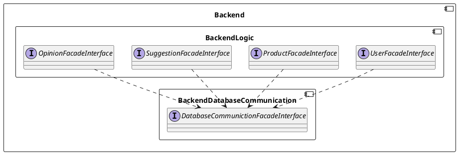
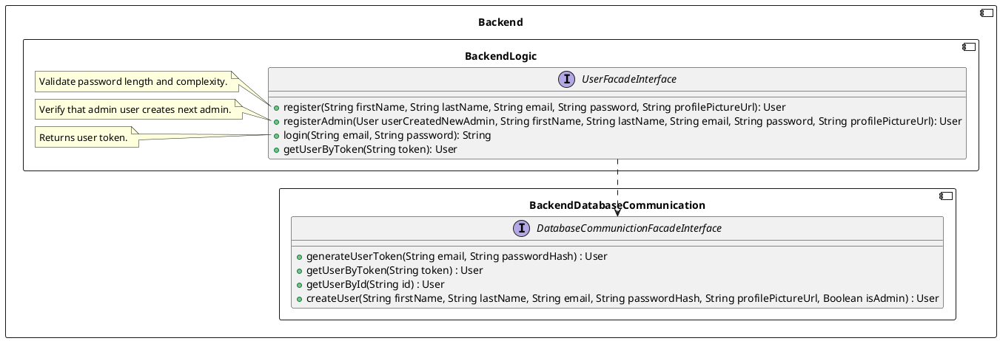
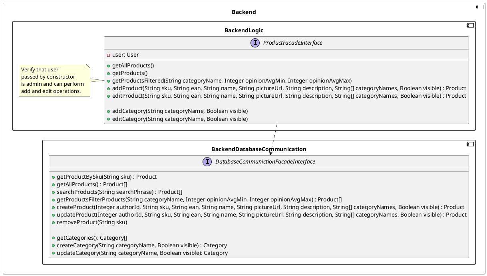
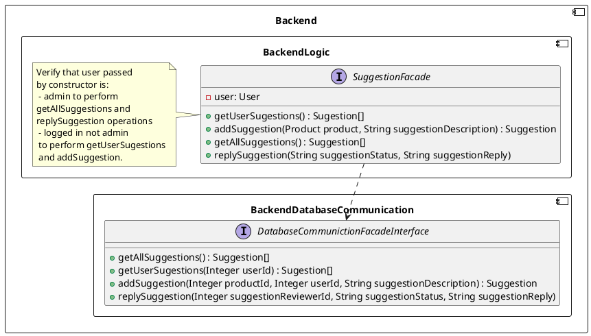
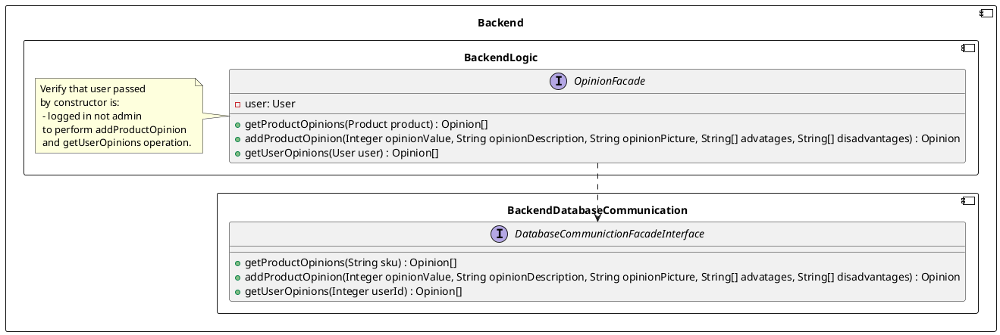

# Backend logic layer

```plantuml
@startuml
component Backend {
    component BackendDatabaseCommunication {
        interface DatabaseCommunictionFacadeInterface
    }
    
    component BackendLogic {
        interface UserFacadeInterface
        interface ProductFacadeInterface
        interface SuggestionFacadeInterface
        interface OpinionFacadeInterface
        
        UserFacadeInterface  ..> DatabaseCommunictionFacadeInterface
        ProductFacadeInterface   ..> DatabaseCommunictionFacadeInterface
        SuggestionFacadeInterface ..> DatabaseCommunictionFacadeInterface
        OpinionFacadeInterface   ..> DatabaseCommunictionFacadeInterface
    }
}
@enduml 
```

## UserFacade

```plantuml
@startuml
component Backend {
    component BackendDatabaseCommunication {
        interface DatabaseCommunictionFacadeInterface {
            + generateUserToken(String email, String passwordHash) : User
            + getUserByToken(String token) : User
            + getUserById(String id) : User
            + createUser(String firstName, String lastName, String email, String passwordHash, String profilePictureUrl, Boolean isAdmin) : User
        }
    }
    
    component BackendLogic {
        UserFacadeInterface  ..> DatabaseCommunictionFacadeInterface
        
        interface UserFacadeInterface {
            + register(String firstName, String lastName, String email, String password, String profilePictureUrl): User
            + registerAdmin(User userCreatedNewAdmin, String firstName, String lastName, String email, String password, String profilePictureUrl): User
            + login(String email, String password): String
            + getUserByToken(String token): User
        }
    
        note left of UserFacadeInterface::register
            Validate password length and complexity.
        endnote
    
        note left of UserFacadeInterface::registerAdmin
            Verify that admin user creates next admin.
        endnote
    
        note left of UserFacadeInterface::login
            Returns user token.
        endnote
    }
}
@enduml 
```

## ProductFacade

```plantuml
@startuml
component Backend {
    component BackendDatabaseCommunication {
        interface DatabaseCommunictionFacadeInterface {
            + getProductBySku(String sku) : Product
            + getAllProducts() : Product[]
            + searchProducts(String searchPhrase) : Product[]
            + getProductsFilterProducts(String categoryName, Integer opinionAvgMin, Integer opinionAvgMax) : Product[]
            + createProduct(Integer authorId, String sku, String ean, String name, String pictureUrl, String description, String[] categoryNames, Boolean visible) : Product
            + updateProduct(Integer authorId, String sku, String ean, String name, String pictureUrl, String description, String[] categoryNames, Boolean visible) : Product
            + removeProduct(String sku)
            
            + getCategories(): Category[]
            + createCategory(String categoryName, Boolean visible) : Category
            + updateCategory(String categoryName, Boolean visible): Category
        }
    }
    
    component BackendLogic {
        ProductFacadeInterface  ..> DatabaseCommunictionFacadeInterface
        interface ProductFacadeInterface {
            - user: User
            + getAllProducts()
            + getProducts()
            + getProductsFiltered(String categoryName, Integer opinionAvgMin, Integer opinionAvgMax)
            + addProduct(String sku, String ean, String name, String pictureUrl, String description, String[] categoryNames, Boolean visible) : Product
            + editProduct(String sku, String ean, String name, String pictureUrl, String description, String[] categoryNames, Boolean visible) : Product
            
            + addCategory(String categoryName, Boolean visible)
            + editCategory(String categoryName, Boolean visible)
        }
    
        note left of ProductFacadeInterface
            Verify that user
            passed by constructor
            is admin and can perform
            add and edit operations.
        endnote
    }
}
@enduml 
```

## SuggestionFacade

```plantuml
@startuml
component Backend {
    component BackendDatabaseCommunication {
        interface DatabaseCommunictionFacadeInterface {
            + getAllSuggestions() : Suggestion[]
            + getUserSugestions(Integer userId) : Sugestion[]
            + addSuggestion(Integer productId, Integer userId, String suggestionDescription) : Suggestion
            + replySuggestion(Integer suggestionReviewerId, String suggestionStatus, String suggestionReply)
        }
    }
    
    component BackendLogic {
        SuggestionFacade  ..> DatabaseCommunictionFacadeInterface
        interface SuggestionFacade {
            - user: User
            + getUserSugestions() : Sugestion[]
            + addSuggestion(Product product, String suggestionDescription) : Suggestion
            + getAllSuggestions() : Suggestion[]
            + replySuggestion(String suggestionStatus, String suggestionReply)
        }
    
        note left of SuggestionFacade
            Verify that user passed
            by constructor is:
             - admin to perform 
            getAllSuggestions and
            replySuggestion operations
             - logged in not admin
             to perform getUserSugestions
             and addSuggestion.
        endnote
    }
}
@enduml 
```

## OpinionFacade

```plantuml
@startuml
component Backend {
    component BackendDatabaseCommunication {
        interface DatabaseCommunictionFacadeInterface {
            + getProductOpinions(String sku) : Opinion[]
            + addProductOpinion(Integer opinionValue, String opinionDescription, String opinionPicture, String[] advatages, String[] disadvantages) : Opinion
            + getUserOpinions(Integer userId) : Opinion[]
        }
    }
    
    component BackendLogic {
        OpinionFacade  ..> DatabaseCommunictionFacadeInterface
        interface OpinionFacade {
            - user: User
            + getProductOpinions(Product product) : Opinion[]
            + addProductOpinion(Integer opinionValue, String opinionDescription, String opinionPicture, String[] advatages, String[] disadvantages) : Opinion
            + getUserOpinions(User user) : Opinion[]
        }
    
        note left of OpinionFacade
            Verify that user passed
            by constructor is:
             - logged in not admin
             to perform addProductOpinion
             and getUserOpinions operation.
        endnote
    }
}
@enduml 
```