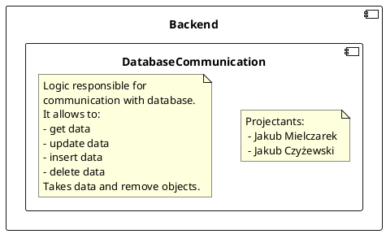
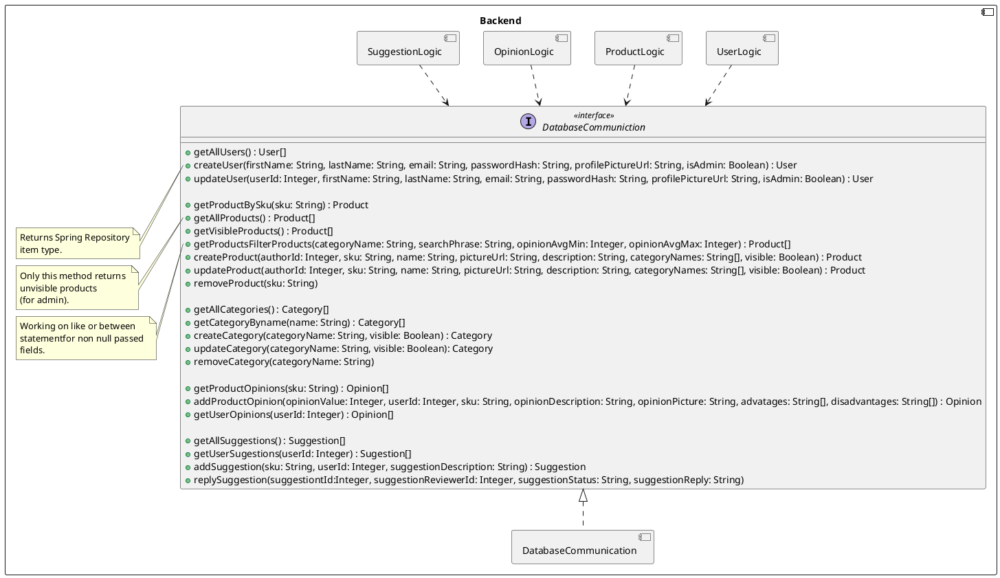

# Backend - Database Communication

```plantuml
@startuml
component Backend {
    component DatabaseCommunication {
        note as Authors
            Projectants: 
             - Jakub Mielczarek
             - Jakub Czyżewski
        endnote
        note as Description
            Logic responsible for
            communication with database.
            It allows to:
            - get data
            - update data
            - insert data
            - delete data
            Takes data and remove objects.
        endnote
    }
}

@enduml 
```

```plantuml
@startuml
component Backend {
    component UserLogic {
    }
    component ProductLogic {
    }
    component OpinionLogic {
    }
    component SuggestionLogic {
    }
    
    component DatabaseCommunication {
    }
    
    interface DatabaseCommuniction <<interface>> {
        + getAllUsers() : User[]
        + createUser(firstName: String, lastName: String, email: String, passwordHash: String, profilePictureUrl: String, isAdmin: Boolean) : User
        + updateUser(userId: Integer, firstName: String, lastName: String, email: String, passwordHash: String, profilePictureUrl: String, isAdmin: Boolean) : User
    
        + getProductBySku(sku: String) : Product
        + getAllProducts() : Product[]
        + getVisibleProducts() : Product[]
        + getProductsFilterProducts(categoryName: String, searchPhrase: String, opinionAvgMin: Integer, opinionAvgMax: Integer) : Product[]
        + createProduct(authorId: Integer, sku: String, name: String, pictureUrl: String, description: String, categoryNames: String[], visible: Boolean) : Product
        + updateProduct(authorId: Integer, sku: String, name: String, pictureUrl: String, description: String, categoryNames: String[], visible: Boolean) : Product
        + removeProduct(sku: String)

        + getAllCategories() : Category[]
        + getCategoryByname(name: String) : Category[]
        + createCategory(categoryName: String, visible: Boolean) : Category
        + updateCategory(categoryName: String, visible: Boolean): Category
        + removeCategory(categoryName: String)
        
        + getProductOpinions(sku: String) : Opinion[]
        + addProductOpinion(opinionValue: Integer, userId: Integer, sku: String, opinionDescription: String, opinionPicture: String, advatages: String[], disadvantages: String[]) : Opinion
        + getUserOpinions(userId: Integer) : Opinion[]
        
        + getAllSuggestions() : Suggestion[]
        + getUserSugestions(userId: Integer) : Sugestion[]
        + addSuggestion(sku: String, userId: Integer, suggestionDescription: String) : Suggestion
        + replySuggestion(suggestiontId:Integer, suggestionReviewerId: Integer, suggestionStatus: String, suggestionReply: String)
    }
    note left of DatabaseCommuniction::createUser
        Returns Spring Repository
        item type.
    endnote
    
    note left of DatabaseCommuniction::getAllProducts
        Only this method returns 
        unvisible products
        (for admin).
    endnote
    
    note left of DatabaseCommuniction::getProductsFilterProducts
        Working on like or between 
        statementfor non null passed 
        fields.
    endnote
    
    UserLogic                   ..>  DatabaseCommuniction
    ProductLogic                ..>  DatabaseCommuniction
    OpinionLogic                ..>  DatabaseCommuniction
    SuggestionLogic             ..>  DatabaseCommuniction
    DatabaseCommuniction        <|..  DatabaseCommunication
}

@enduml 
```