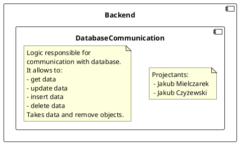
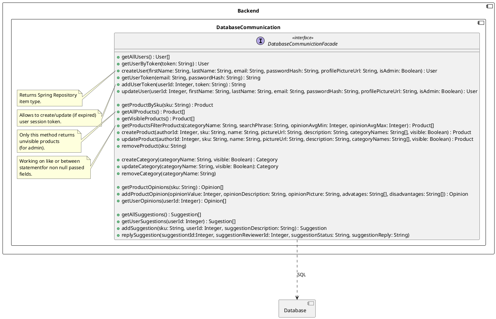

# Backend - Database Communication

```plantuml
@startuml
component Backend {
    component DatabaseCommunication {
        note as Authors
            Projectants: 
             - Jakub Mielczarek
             - Jakub Czyżewski
        endnote
        note as Description
            Logic responsible for
            communication with database.
            It allows to:
            - get data
            - update data
            - insert data
            - delete data
            Takes data and remove objects.
        endnote
    }
}

@enduml 
```

```plantuml
@startuml

component Database {
}
component Backend {
    component DatabaseCommunication {
        interface DatabaseCommunictionFacade <<interface>> {
            + getAllUsers() : User[]
            + getUserByToken(token: String) : User
            + createUser(firstName: String, lastName: String, email: String, passwordHash: String, profilePictureUrl: String, isAdmin: Boolean) : User
            + getUserToken(email: String, passwordHash: String) : String
            + addUserToken(userId: Integer, token: String) : String
            + updateUser(userId: Integer, firstName: String, lastName: String, email: String, passwordHash: String, profilePictureUrl: String, isAdmin: Boolean) : User
        
            + getProductBySku(sku: String) : Product
            + getAllProducts() : Product[]
            + getVisibleProducts() : Product[]
            + getProductsFilterProducts(categoryName: String, searchPhrase: String, opinionAvgMin: Integer, opinionAvgMax: Integer) : Product[]
            + createProduct(authorId: Integer, sku: String, name: String, pictureUrl: String, description: String, categoryNames: String[], visible: Boolean) : Product
            + updateProduct(authorId: Integer, sku: String, name: String, pictureUrl: String, description: String, categoryNames: String[], visible: Boolean) : Product
            + removeProduct(sku: String)

            + createCategory(categoryName: String, visible: Boolean) : Category
            + updateCategory(categoryName: String, visible: Boolean): Category
            + removeCategory(categoryName: String)
            
            + getProductOpinions(sku: String) : Opinion[]
            + addProductOpinion(opinionValue: Integer, opinionDescription: String, opinionPicture: String, advatages: String[], disadvantages: String[]) : Opinion
            + getUserOpinions(userId: Integer) : Opinion[]
            
            + getAllSuggestions() : Suggestion[]
            + getUserSugestions(userId: Integer) : Sugestion[]
            + addSuggestion(sku: String, userId: Integer, suggestionDescription: String) : Suggestion
            + replySuggestion(suggestiontId:Integer, suggestionReviewerId: Integer, suggestionStatus: String, suggestionReply: String)
        }
        note left of DatabaseCommunictionFacade::createUser
            Returns Spring Repository
            item type.
        endnote
        
        note left of DatabaseCommunictionFacade::addUserToken
            Allows to create/update (if expired)
            user session token.
        endnote
        
        note left of DatabaseCommunictionFacade::getAllProducts
            Only this method returns 
            unvisible products
            (for admin).
        endnote
        
        note left of DatabaseCommunictionFacade::getProductsFilterProducts
            Working on like or between 
            statementfor non null passed 
            fields.
        endnote
    }
}

DatabaseCommunictionFacade ...> Database : SQL

@enduml 
```