# Backend - Database Communication
## Description

```plantuml
@startuml
component Backend {
    component DatabaseCommunication {
        note as Authors
            Projectants: 
             - Jakub Mielczarek
             - Jakub Czyżewski
        endnote
        note as Description
            Logic responsible for
            communication with database.
            It allows to:
            - get data
            - update data
            - insert data
            - delete data
            Takes data and remove objects.
        endnote
    }
}

@enduml 
```

<!--

-->

## API
<!--

-->

## Class diagrams
### Relation between data classes
<!--
```plantuml
component Backend {
    component DatabaseCommuniction {
        class Suggestion {
        }
        class User {
            - userId: Integer
            - firstName: String
            - email: String
            - passwordHash: String
            - profilePictureUrl: String
            - admin: Boolean
        }
        class Opinion {
            - opinionId: Integer
            - userId: Integer
            - opinionValue: Integer
            - opinionDescription: String
            - opinionPitureUrl: String
            - advantages: String[]
            - disadvantages: String[]
        }
        class Product {
            - productId: Integer
            - authorId: Integer
            - sku: String
            - pictureUrl: String
            - description: String
            - categoryName: String
        }
        class Category {
            - categoryId: Integer
            - categoryName: String
            - visible: Boolean
        }
        class Suggestion {
            - suggestionId: Integer
            - productId: Integer
            - reviewerId: Integer
            - userId: Integer
            - description: String
        }
        class Review {
            - reviewerId: Integer
            - suggestionId: Integer
            - reply: string
            - status: String
        }
        Product    "1" o-- "0..*" Opinion    : has
        Product    "1" o-- "0..*" Suggestion : has
        Product    "1" *-- "0..*" User       : has autor of
        Product    "1" --- "0..*" Category   : has
        Suggestion "1" o-- "0..*" Review    : has
        User       "1" o-- "0..*" Opinion    : gives
        User       "1" --- "0..*" Suggestion : reviews
        User       "1" o-- "0..*" Suggestion : suggest
        
        UserDatabaseCommuniation        ..> User
        ProductDatabaseCommuniation     ..> Product
        SuggestionDatabaseCommuniation  ..> Suggestion
        OpinionDatabaseCommuniation     ..> Opinion
        CategoryDatabaseCommuniation    ..> Category
        
        DatabaseCommunictionFacadeImplementation ..> User
        DatabaseCommunictionFacadeImplementation ..> Product
        DatabaseCommunictionFacadeImplementation ..> Suggestion
        DatabaseCommunictionFacadeImplementation ..> Opinion
        DatabaseCommunictionFacadeImplementation ..> Category
    }
}
```
-->


### Relation between facade and classes which are using it
<!--

-->
