# Backend - Opinion Logic
## Description

```plantuml
@startuml
component Backend {
    component OpinionLogic {
        note as Authors
            Projectants: 
             - Paweł Wieczorek
             - Julian Woroniecki
        endnote
        note as Description
            Creates endpoints for:
            - GET /opinions/user - get user opinions
            - GET /opinions/product - get product opinions
            - POST /opinions/add - add opinion
            Uses DatabaseCommunication component to data operations.
        endnote
    }
}
@enduml 
```

<!--

-->

## API
<!--

-->

## Class diagrams
<!--
```plantuml
circle Opinions
component Backend {
    component OpinionLogic {
        class OpinionController {
            + getProductOpinions(sku: String) : Opinion[]
            + addProductOpinion(opinionValue: Integer, sku: String, opinionDescription: String, opinionPicture: String, advatages: String[], disadvantages: String[]) : Opinion
            + getUserOpinions() : Opinion[]
        }
        class OpinionService {
            + getProductOpinions(sku: String) : Opinion[]
            + addProductOpinion(authorId: Integer,opinionValue: Integer, sku: String, opinionDescription: String, opinionPicture: String, advatages: String[], disadvantages: String[]) : Opinion
            + getUserOpinions() : Opinion[]
        }
        OpinionController o-- OpinionService
        Opinions -- OpinionController
    }
    component DatabaseCommunication {
        class DatabaseCommunictionFacadeImplementation
        class Opinion
    }
    OpinionService -(0- DatabaseCommunictionFacadeImplementation : DatabaseCommunication
    
    component UserLogic {
        class UserFacadeImpl {
            + getUserByToken(token: String) : User
        }
    }
    OpinionController -(0-- UserFacadeImpl : UserAuth
    OpinionService    ..> Opinion
}
```
-->
