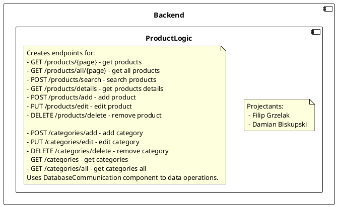
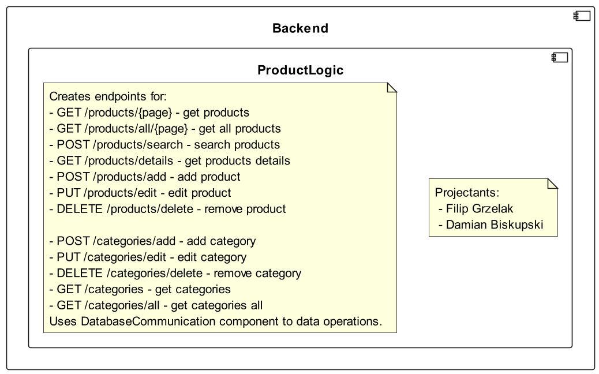
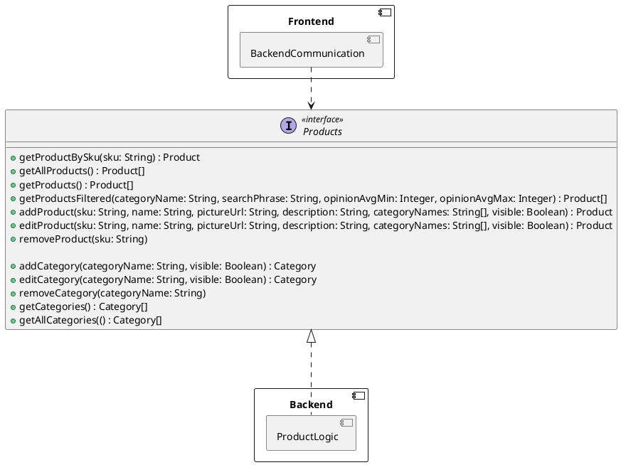
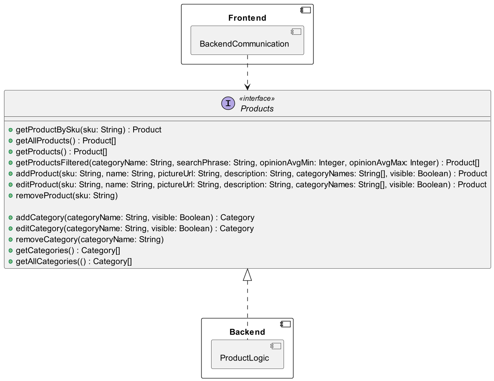
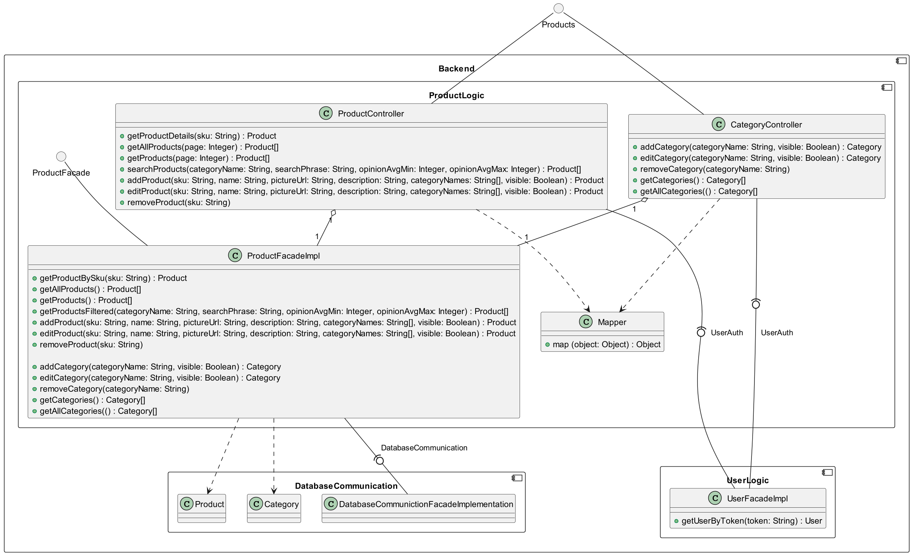

# Backend - ProductLogic
## Description
<!--

-->


## API
<!--

-->

## Class diagrams
<!--
```plantuml
circle Products
component Backend {
    component ProductLogic {
        class ProductController {
            + getProductDetails(sku: String) : Product
            + getAllProducts(page: Integer) : Product[]
            + getProducts(page: Integer) : Product[]
            + searchProducts(categoryName: String, searchPhrase: String, opinionAvgMin: Integer, opinionAvgMax: Integer) : Product[]
            + addProduct(sku: String, name: String, pictureUrl: String, description: String, categoryNames: String[], visible: Boolean) : Product
            + editProduct(sku: String, name: String, pictureUrl: String, description: String, categoryNames: String[], visible: Boolean) : Product
            + removeProduct(sku: String)
        }
        class CategoryController {
            + addCategory(categoryName: String, visible: Boolean) : Category
            + editCategory(categoryName: String, visible: Boolean) : Category
            + removeCategory(categoryName: String)
            + getCategories() : Category[]
            + getAllCategories(() : Category[]
        }
        circle ProductFacade
        class ProductFacadeImpl {
            + getProductBySku(sku: String) : Product
            + getAllProducts() : Product[]
            + getProducts() : Product[]
            + getProductsFiltered(categoryName: String, searchPhrase: String, opinionAvgMin: Integer, opinionAvgMax: Integer) : Product[]
            + addProduct(sku: String, name: String, pictureUrl: String, description: String, categoryNames: String[], visible: Boolean) : Product
            + editProduct(sku: String, name: String, pictureUrl: String, description: String, categoryNames: String[], visible: Boolean) : Product
            + removeProduct(sku: String)
            
            + addCategory(categoryName: String, visible: Boolean) : Category
            + editCategory(categoryName: String, visible: Boolean) : Category
            + removeCategory(categoryName: String)
            + getCategories() : Category[]
            + getAllCategories(() : Category[]
        }
        ProductFacade -- ProductFacadeImpl
        CategoryController "1" o-- "1" ProductFacadeImpl
        ProductController  "1" o-- "1" ProductFacadeImpl
        Products -- ProductController
        Products -- CategoryController
        
        class Mapper {
            +map (object: Object) : Object
        }
        CategoryController ..> Mapper
        ProductController  ..> Mapper
    }
    component DatabaseCommunication {
        class DatabaseCommunictionFacadeImplementation
        class Product
        class Category
    }
    ProductFacadeImpl -(0- DatabaseCommunictionFacadeImplementation : DatabaseCommunication
    ProductFacadeImpl ..>  Product
    ProductFacadeImpl ..>  Category
    
    component UserLogic {
        class UserFacadeImpl {
            + getUserByToken(token: String) : User
        }
    }
    ProductController  -(0-- UserFacadeImpl  : UserAuth
    CategoryController -(0-- UserFacadeImpl : UserAuth
}
```
-->
