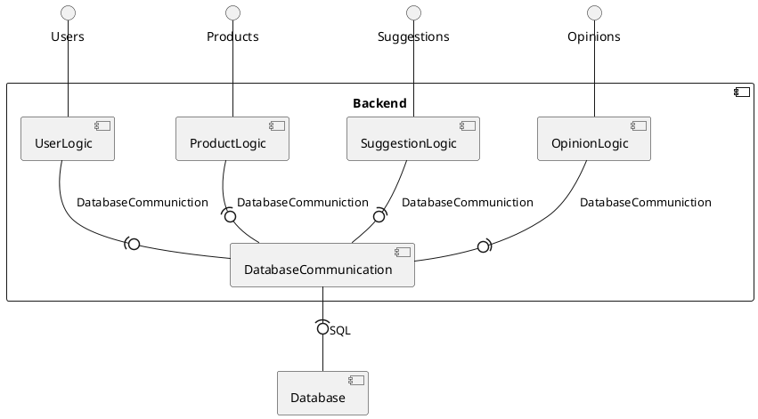

# Backend
## Components diagram
<!--

-->

## Table of Contents:
1. [Database Communication](DatabaseCommunication)
2. [Users](Users)
3. [Products and Categories](ProductsAndCategories)
4. [Suggestions](Suggestions)
5. [Opinions](Opinions)