# Backend - Suggestion Logic
## Description

```plantuml
@startuml
component Backend {
    component SuggestionLogic {
        note as Authors
            Projectants: 
             - Paweł Wieczorek
             - Julian Woroniecki
        endnote
        note as Description
            Creates endpoints for:
            - GET /suggestions/user - get user suggestions
            - POST /suggestions/add - add suggestion
            - GET /suggestions/get - get all suggestions
            - PUT /suggestions/reply - reply to suggestion
            Uses DatabaseCommunication component to data operations.
        endnote
}
@enduml 
```

<!--

-->


## API
<!--

-->


## Class diagrams
<!--
```plantuml
circle Suggestions
component Backend {
    component SuggestionLogic {
        class SuggestionController {
            + getUserSugestions() : Sugestion[]
            + addSuggestion(sku: String, suggestionDescription: String) : Suggestion
            + getAllSuggestions() : Suggestion[]
            + replySuggestion(suggestiontId:Integer, suggestionStatus: String, suggestionReply: String)
        }
        class SuggestionService {
            + getUserSugestions(userId: Long) : Sugestion[]
            + addSuggestion(userId: Long, sku: String, suggestionDescription: String) : Suggestion
            + getAllSuggestions() : Suggestion[]
            + replySuggestion(reviewerId: Long, suggestiontId:Integer, suggestionStatus: String, suggestionReply: String)
        }
        SuggestionController o-- SuggestionService
        Suggestions -- SuggestionController
    }
    component DatabaseCommunication {
        class DatabaseCommunictionFacadeImplementation
        class Suggestion
    }
    SuggestionService -(0- DatabaseCommunictionFacadeImplementation : UserAuth
    
    component UserLogic {
        class UserFacadeImpl {
            + getUserByToken(token: String) : User
        }
    }
    SuggestionController -(0-- UserFacadeImpl : UserAuth
    SuggestionService    ..> Suggestion
}
```
-->
