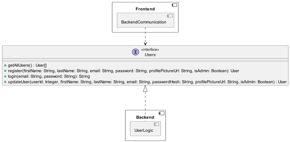

# Backend - User Logic
## Description
<!--

-->

## API
<!--

-->

<!--

-->

## Class diagrams
<!--
```plantuml
circle Users
component Backend {
    component UserLogic {
        class UserController {
            + getAllUsers() : User[]
            + register(firstName: String, lastName: String, email: String, password: String, profilePictureUrl: String, isAdmin: Boolean): User
            + login(email: String, password: String): String
            + update(userId: Integer, firstName: String, lastName: String, email: String, passwordHash: String, profilePictureUrl: String, isAdmin: Boolean) : User
        }
        circle UserFacade
        circle UserAuth
        class UserFacadeImpl {
            + getAllUsers() : User[]
            + register(firstName: String, lastName: String, email: String, password: String, profilePictureUrl: String): User
            + registerAdmin(firstName: String, lastName: String, email: String, password: String, profilePictureUrl: String): User
            + login(email: String, password: String): String
            + updateUser(userId: Integer, firstName: String, lastName: String, email: String, passwordHash: String, profilePictureUrl: String, isAdmin: Boolean) : User
            + getUserByToken(token: String) : User
        }
        UserFacade -- UserFacadeImpl
        UserAuth   -- UserFacadeImpl
        Users -- UserController
        
        UserController "1" o-- "1" UserFacadeImpl
        
        class Mapper {
            +map (object: Object) : Object
        }
        UserController ..> Mapper
    }
    
    component DatabaseCommunication {
        class DatabaseCommunictionFacadeImplementation
        class User
    }
    UserFacadeImpl -(0- DatabaseCommunictionFacadeImplementation : DatabaseCommunication
    UserFacadeImpl ..> User
    
}
```
-->
