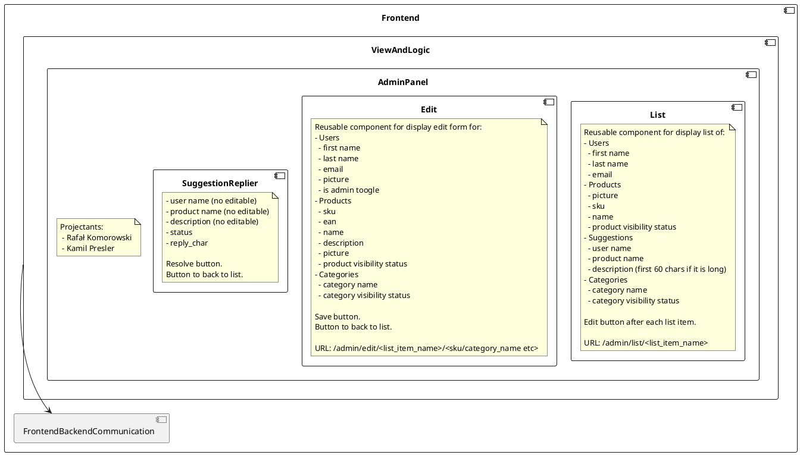

# Admin Panel

```plantuml
@startuml
    
component Frontend {
    component ViewAndLogic {
        component AdminPanel {
            note as AuthorsAP
                Projectants: 
                 - Rafał Komorowski
                 - Kamil Presler
            endnote
            component List {
                note as ListDescription
                    Reusable component for display list of:
                    - Users
                      - first name
                      - last name
                      - email
                    - Products
                      - picture
                      - sku
                      - name
                      - product visibility status
                    - Suggestions
                      - user name
                      - product name
                      - description (first 60 chars if it is long)
                    - Categories
                      - category name
                      - category visibility status
                    
                    Edit button after each list item.
                    
                    URL: /admin/list/<list_item_name>
                endnote
            }
            component Edit {
                note as EditDescription
                    Reusable component for display edit form for:
                    - Users
                      - first name
                      - last name
                      - email
                      - picture
                      - is admin toogle
                    - Products
                      - sku
                      - ean
                      - name
                      - description
                      - picture
                      - product visibility status
                    - Categories
                      - category name
                      - category visibility status
                    
                    Save button.
                    Button to back to list.
                    
                    URL: /admin/edit/<list_item_name>/<sku/category_name etc>
                endnote
            }
            
            component SuggestionReplier {
                note as SuggestionReplierDescription
                  - user name (no editable)
                  - product name (no editable)
                  - description (no editable)
                  - status
                  - reply_char
                    
                  Resolve button.
                  Button to back to list.
              endnote
            }
        }
    }
    
    component FrontendBackendCommunication {
    }

    ViewAndLogic --> FrontendBackendCommunication
}

@enduml 
```