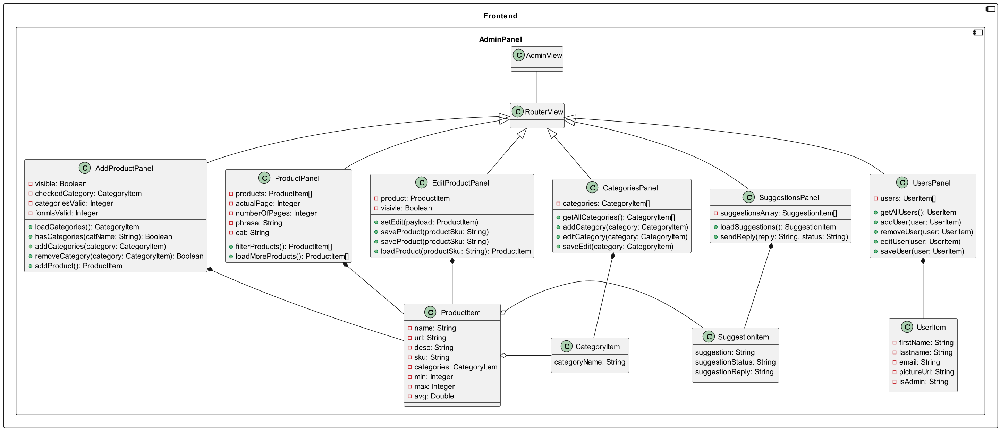
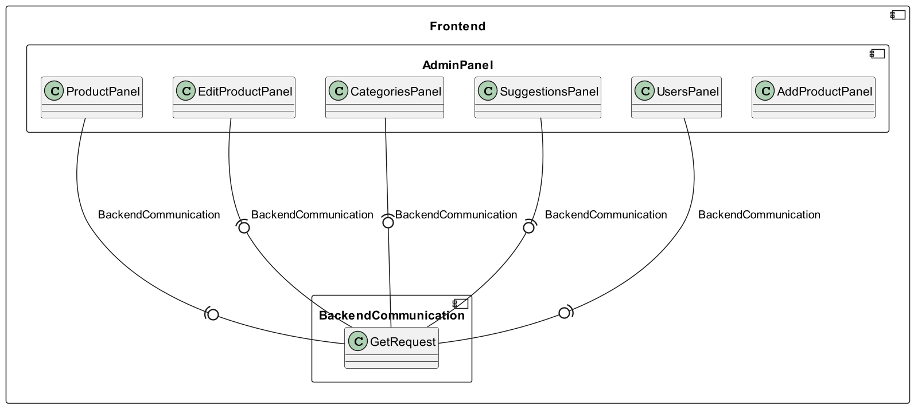
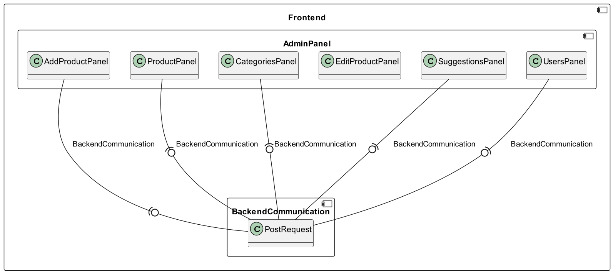
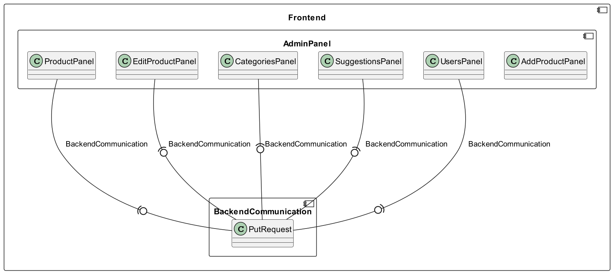
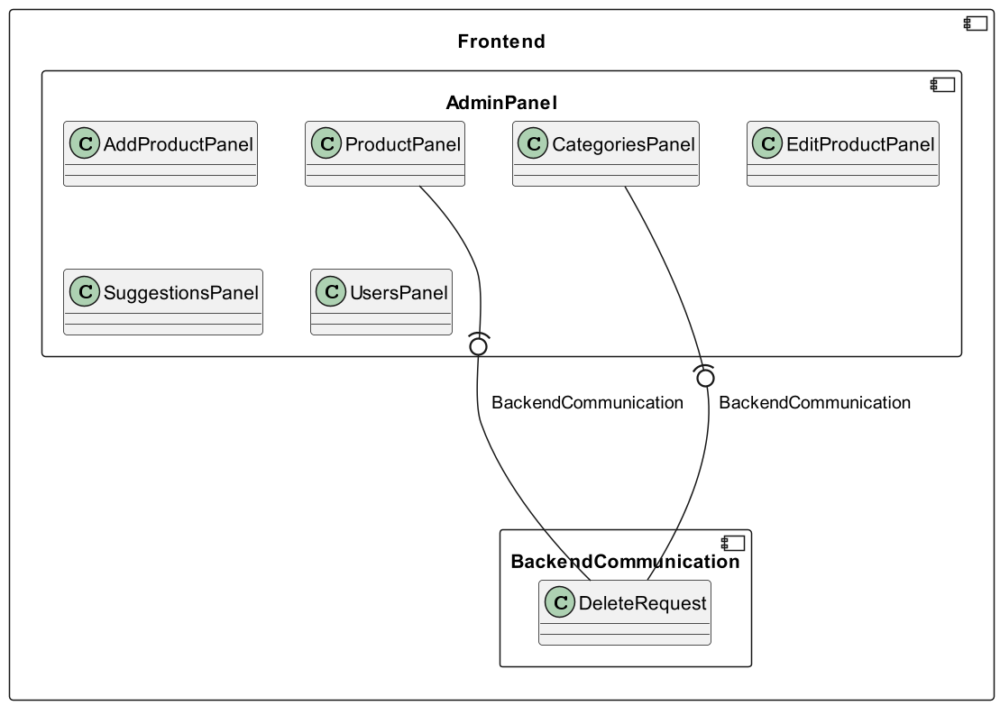

# Frontend - Admin Panel
## Description

```plantuml
@startuml
    
component Frontend {
    component AdminPanel {
        note as AuthorsAP
            Projectants: 
             - Rafał Komorowski
             - Kamil Presler
        endnote
        note as Description
            Component responsible for:
            - Main admin panel page
            - Display list with edit button of:
              - Users
              - Product
              - Suggestions
              - Categories
            - Edit:
              - Users
              - Product
              - Categories
            - Reply suggestions
        endnote
    }
}

@enduml 
```

<!--

-->

## Class diagrams
### Admin Frontend class diagram
<!--
```plantuml
component Frontend {
    component AdminPanel {
        class AdminView
        AdminView -- RouterView
        
        class RouterView
        RouterView <|-- AddProductPanel
        RouterView <|-- ProductPanel
        RouterView <|-- EditProductPanel
        RouterView <|-- CategoriesPanel
        RouterView <|-- SuggestionsPanel
        RouterView <|-- UsersPanel
        
        class AddProductPanel {
            - visible: Boolean
            - checkedCategory: CategoryItem
            - categoriesValid: Integer
            - formIsValid: Integer
            + loadCategories(): CategoryItem
            + hasCategories(catName: String): Boolean
            + addCategories(category: CategoryItem)
            + removeCategory(category: CategoryItem): Boolean
            + addProduct(): ProductItem
        }
        AddProductPanel *-- ProductItem
        
        class ProductPanel {
            - products: ProductItem[]
            - actualPage: Integer
            - numberOfPages: Integer
            - phrase: String
            - cat: String
            + filterProducts(): ProductItem[]
            + loadMoreProducts(): ProductItem[]
        }
        ProductPanel *-- ProductItem
        
        class EditProductPanel {
            - product: ProductItem
            - visivle: Boolean
            + setEdit(payload: ProductItem)
            + saveProduct(productSku: String)
            + saveProduct(productSku: String)
            + loadProduct(productSku: String): ProductItem
        }
        EditProductPanel *-- ProductItem
        
        class CategoriesPanel {
            - categories: CategoryItem[]
            + getAllCategories(): CategoryItem[]
            + addCategory(category: CategoryItem)
            + editCategory(category: CategoryItem)
            + saveEdit(category: CategoryItem)
        }
        CategoriesPanel *-- CategoryItem
        
        class SuggestionsPanel {
            - suggestionsArray: SuggestionItem[]
            + loadSuggestions(): SuggestionItem
            + sendReply(reply: String, status: String)
        }
        SuggestionsPanel *-- SuggestionItem
        
        class UsersPanel {
            - users: UserItem[]
            + getAllUsers(): UserItem
            + addUser(user: UserItem)
            + removeUser(user: UserItem)
            + editUser(user: UserItem)
            + saveUser(user: UserItem)
        }
        UsersPanel *-- UserItem
        
        class UserItem {
            - firstName: String
            - lastname: String
            - email: String
            - pictureUrl: String
            - isAdmin: String
        }
        
        class ProductItem {
            - name: String
            - url: String
            - desc: String
            - sku: String
            - categories: CategoryItem
            - min: Integer
            - max: Integer
            - avg: Double
        }
        ProductItem o- CategoryItem
        ProductItem o- SuggestionItem
        
        class CategoryItem {
            categoryName: String
        }
        
        class SuggestionItem {
            suggestion: String
            suggestionStatus: String
            suggestionReply: String
        }
    }
}
```
-->

### Connections with BackendCommunication - GET
<!--
```plantuml
component Frontend {
    component AdminPanel {
        class AddProductPanel
        class ProductPanel
        class EditProductPanel
        class CategoriesPanel
        class SuggestionsPanel
        class UsersPanel
    }
    component BackendCommunication {
        class GetRequest
    }
    EditProductPanel --(0-- GetRequest  : BackendCommunication
    
    CategoriesPanel --(0-- GetRequest    : BackendCommunication
    
    SuggestionsPanel --(0-- GetRequest    : BackendCommunication
    
    UsersPanel --(0-- GetRequest    : BackendCommunication
    
    ProductPanel --(0-- GetRequest    : BackendCommunication
}
```
-->

### Connections with BackendCommunication - POST
<!--
```plantuml
component Frontend {
    component AdminPanel {
        class AddProductPanel
        class ProductPanel
        class EditProductPanel
        class CategoriesPanel
        class SuggestionsPanel
        class UsersPanel
    }
    component BackendCommunication {
        class PostRequest
    }
    AddProductPanel  --(0-- PostRequest : BackendCommunication
    
    CategoriesPanel --(0-- PostRequest   : BackendCommunication
    
    SuggestionsPanel --(0-- PostRequest   : BackendCommunication
    
    UsersPanel --(0-- PostRequest   : BackendCommunication
    
    ProductPanel --(0-- PostRequest   : BackendCommunication
}
```
-->

### Connections with BackendCommunication - PUT
<!--
```plantuml
component Frontend {
    component AdminPanel {
        class AddProductPanel
        class ProductPanel
        class EditProductPanel
        class CategoriesPanel
        class SuggestionsPanel
        class UsersPanel
    }
    component BackendCommunication {
        class PutRequest
    }
    EditProductPanel --(0-- PutRequest  : BackendCommunication
    
    CategoriesPanel --(0-- PutRequest    : BackendCommunication
    
    SuggestionsPanel --(0-- PutRequest    : BackendCommunication
    
    UsersPanel --(0-- PutRequest    : BackendCommunication

    ProductPanel --(0-- PutRequest    : BackendCommunication
}
```
-->

### Connections with BackendCommunication - DELETE
<!--
```plantuml
component Frontend {
    component AdminPanel {
        class AddProductPanel
        class ProductPanel
        class EditProductPanel
        class CategoriesPanel
        class SuggestionsPanel
        class UsersPanel
    }
    component BackendCommunication {
        class DeleteRequest
    }
    CategoriesPanel --(0-- DeleteRequest : BackendCommunication
    ProductPanel --(0-- DeleteRequest : BackendCommunication
}
```
-->
