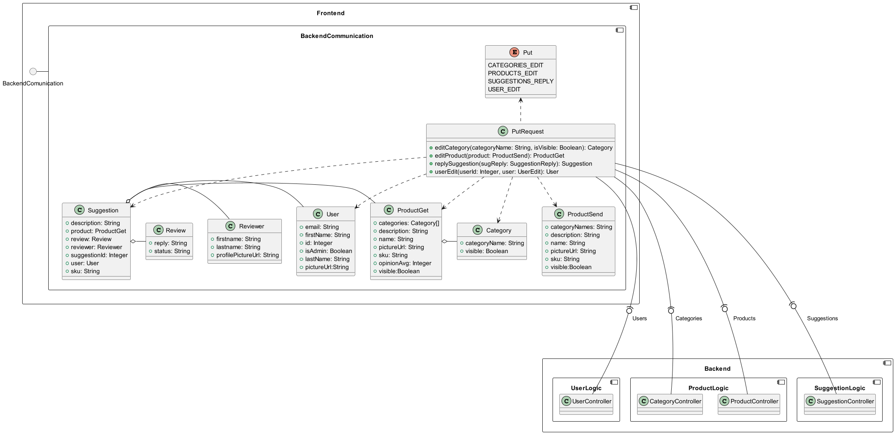

# Frontend - Backend Communication
## Description
<!--

-->

## API
<!--

-->

## Class diagrams
### GET
<!--
```plantuml
component Frontend {
    circle BackendComunication
    component BackendCommunication {
        enum Get {
            CATEGORIES
            CATEGORIES_ALL
            OPINIONS_PRODUCT
            OPINIONS_USER
            PRODUCTS
            PRODUCTS_ALL
            PRODUCTS_DETAILS
            PRODUCTS_SEARCH
            SUGGESTIONS_ALL
            SUGGESTIONS_USER
            USERS_ALL
        }
        
        class Category {
            + categoryName: String
            + visible: Boolean
        }
        
        class Opinion {
            + advantages: String[]
            + description: String
            + disadvantages: String[]
            + firstName: String
            + opinionValue: Integer
            + opinionAvg: Integer
            + pictureUrl: String
            + sku: String
        }
        
        class ProductGet {
            + categories: Category[]
            + description: String
            + name: String
            + pictureUrl: String
            + sku: String
            + opinionAvg: Integer
            + visible:Boolean
        }
        
        class Page {
            + actualPage: Integer
            + numberOfPages: Integer
            + products: ProductGet[]
        }
        
        class Suggestion {
            + description: String
            + product: ProductGet
            + review: Review
            + reviewer: Reviewer
            + suggestionId: Integer
            + user: User
            + sku: String
        }
        
        class User {
            + email: String
            + firstName: String
            + id: Integer
            + isAdmin: Boolean
            + lastName: String
            + pictureUrl:String
        }
        
        class Review {
            + reply: String
            + status: String
        }
        
        class Reviewer {
            + firstname: String
            + lastname: String
            + profilePictureUrl: String
        }
        
        Suggestion o- Reviewer
        Suggestion o- Review
        Suggestion o- User
        Suggestion o- ProductGet
        
        ProductGet o- Category
        
        Page o- ProductGet
        
        class GetRequest {
            + getCategories(): Category[]
            + getAllCategories(): Category[]
            + getProductOpinions(skuval: String): Opinion[]
            + getProducts(page: Integer): Page
            + getAllProducts(page: Integer): Page
            + getProductDetails(skuval: String): ProductGet
            + getSearchProduct(searchInput: ProductSearch): ProductGet[]
            + getAllSuggestions(): Suggestion[]
            + getUserSuggestions() : Suggestion[]
            + getAllUsers(): User[]
        }
        Get <.. GetRequest
        GetRequest ..> Category
        GetRequest ..> Opinion
        GetRequest ..> Page
        GetRequest ..> ProductGet
        GetRequest ..> Suggestion
        GetRequest ..> User
    }
    BackendComunication - BackendCommunication
}
component Backend {
    component UserLogic {
        class UserController
    }
    component ProductLogic {
        class CategoryController
        class ProductController
    }
    component OpinionLogic {
        class OpinionController
    }
    component SuggestionLogic {
        class SuggestionController
    }
}
        
GetRequest -(0- CategoryController   : Categories
GetRequest -(0- ProductController    : Products
GetRequest -(0- OpinionController    : Opinions
GetRequest -(0- SuggestionController : Suggestions
GetRequest -(0- UserController       : Users
```
-->

### POST
<!--
```plantuml
component Frontend {
    circle BackendComunication
    component BackendCommunication {
        enum Post {
            CATEGORIES_ADD
            OPINIONS_ADD
            PRODUCTS_ADD
            SUGGESTIONS_ADD
            USER_LOGIN
            USER_REGISTER
        }
        
        class Category {
            + categoryName: String
            + visible: Boolean
        }
        
        class Opinion {
            + advantages: String[]
            + description: String
            + disadvantages: String[]
            + firstName: String
            + opinionValue: Integer
            + opinionAvg: Integer
            + pictureUrl: String
            + sku: String
        }
        
        class ProductGet {
            + categories: Category[]
            + description: String
            + name: String
            + pictureUrl: String
            + sku: String
            + opinionAvg: Integer
            + visible:Boolean
        }
        
        class ProductSend {
            + categoryNames: String
            + description: String
            + name: String
            + pictureUrl: String
            + sku: String
            + visible:Boolean
        }
        
        class Page {
            + actualPage: Integer
            + numberOfPages: Integer
            + products: ProductGet[]
        }
        
        class Suggestion {
            + description: String
            + product: ProductGet
            + review: Review
            + reviewer: Reviewer
            + suggestionId: Integer
            + user: User
            + sku: String
        }
        
        class UserLogin {
            + email: String
            + password: String
        }
        
        class User {
            + email: String
            + firstName: String
            + id: Integer
            + isAdmin: Boolean
            + lastName: String
            + pictureUrl:String
        }
        
        class UserEdit {
            + email: String
            + firstName: String
            + isAdmin: Boolean
            + lastName: String
            + password: String
            + pictureUrl:String
        }
        
        class Token {
            + token: String
            + type: String
            + user: User
        }
        
        class Review {
            + reply: String
            + status: String
        }
        
        class Reviewer {
            + firstname: String
            + lastname: String
            + profilePictureUrl: String
        }
        
        Suggestion o- Reviewer
        Suggestion o- Review
        Suggestion o- User
        Suggestion o- ProductGet
        
        ProductGet o- Category
        
        Page o- ProductGet
        
        class PostRequest {
            + addCategory(categoryName: String, isVisible: Boolean): Category
            + addOpinion(opinion: Opinion): Opinion
            + addProduct(product: ProductSend): ProductGet
            + addSuggestion(desc: String, skuval: String): Suggestion
            + userLogin(mail: String, pass: String): Token
            + userRegister(user: UserEdit): User
        }
        Post <.. PostRequest
        PostRequest ..> Category
        PostRequest ..> Opinion
        PostRequest ..> ProductGet
        PostRequest ..> ProductSend
        PostRequest ..> Suggestion
        PostRequest ..> Token
        PostRequest ..> User
        PostRequest ..> UserEdit
        PostRequest ..> UserLogin     
    }
    BackendComunication - BackendCommunication
}
component Backend {
    component UserLogic {
        class UserController
    }
    component ProductLogic {
        class CategoryController
        class ProductController
    }
    component OpinionLogic {
        class OpinionController
    }
    component SuggestionLogic {
        class SuggestionController
    }
}
        
PostRequest -(0- CategoryController   : Categories
PostRequest -(0- ProductController    : Products
PostRequest -(0- OpinionController    : Opinions
PostRequest -(0- SuggestionController : Suggestions
PostRequest -(0- UserController       : Users
```
-->

### PUT
<!--
```plantuml
component Frontend {
    circle BackendComunication
    component BackendCommunication {        
        enum Put {
            CATEGORIES_EDIT
            PRODUCTS_EDIT
            SUGGESTIONS_REPLY
            USER_EDIT
        }
        
        class Category {
            + categoryName: String
            + visible: Boolean
        }
        
        class ProductGet {
            + categories: Category[]
            + description: String
            + name: String
            + pictureUrl: String
            + sku: String
            + opinionAvg: Integer
            + visible:Boolean
        }
        
        class ProductSend {
            + categoryNames: String
            + description: String
            + name: String
            + pictureUrl: String
            + sku: String
            + visible:Boolean
        }
        
        class Suggestion {
            + description: String
            + product: ProductGet
            + review: Review
            + reviewer: Reviewer
            + suggestionId: Integer
            + user: User
            + sku: String
        }
        
        class User {
            + email: String
            + firstName: String
            + id: Integer
            + isAdmin: Boolean
            + lastName: String
            + pictureUrl:String
        }
        
        class Review {
            + reply: String
            + status: String
        }
        
        class Reviewer {
            + firstname: String
            + lastname: String
            + profilePictureUrl: String
        }
        
        Suggestion o- Reviewer
        Suggestion o- Review
        Suggestion o- User
        Suggestion o- ProductGet
        
        ProductGet o- Category
        
        class PutRequest {
            + editCategory(categoryName: String, isVisible: Boolean): Category
            + editProduct(product: ProductSend): ProductGet
            + replySuggestion(sugReply: SuggestionReply): Suggestion
            + userEdit(userId: Integer, user: UserEdit): User
        }
        Put <..PutRequest
        PutRequest ..> Category
        PutRequest ..> ProductGet
        PutRequest ..> ProductSend
        PutRequest ..> Suggestion
        PutRequest ..> User   
    }
    BackendComunication - BackendCommunication
}
component Backend {
    component UserLogic {
        class UserController
    }
    component ProductLogic {
        class CategoryController
        class ProductController
    }
    component SuggestionLogic {
        class SuggestionController
    }
}
        
PutRequest --(0-- CategoryController   : Categories
PutRequest --(0-- ProductController    : Products
PutRequest --(0-- SuggestionController : Suggestions
PutRequest --(0-- UserController       : Users
```
-->

### DELETE
<!--
```plantuml
component Frontend {
    circle BackendComunication
    component BackendCommunication {
        
        enum Delete {
            CATEGORIES_DELETE
            PRODUCTS_DELETE
        }
        
        class Category {
            + categoryName: String
            + visible: Boolean
        }
        
        class ProductGet {
            + categories: Category[]
            + description: String
            + name: String
            + pictureUrl: String
            + sku: String
            + opinionAvg: Integer
            + visible:Boolean
        }
        
        class DeleteRequest {
            + deleteCategory(categoryName: String): Category
            + deleteProduct(skuval: String): Product
        }
        Delete <.. DeleteRequest
        DeleteRequest ..> Category
        DeleteRequest ..> ProductGet
    }
    BackendComunication - BackendCommunication
}
component Backend {
    component ProductLogic {
        class CategoryController
        class ProductController
    }
}
        
DeleteRequest -(0-- CategoryController   : Categories
DeleteRequest -(0-- ProductController    : Products
```
-->

### MethodRequest
<!--
```plantuml
component Frontend {
    circle BackendComunication
    component BackendCommunication {
        class User {
            + email: String
            + firstName: String
            + id: Integer
            + isAdmin: Boolean
            + lastName: String
            + pictureUrl:String
        }
        
        class MethodRequest {
            + getUser(): User
            + isTokenAvailable(): Boolean
            + userLogout()
        }
        MethodRequest ..> User      
    }
    BackendComunication - BackendCommunication
}
```
-->
