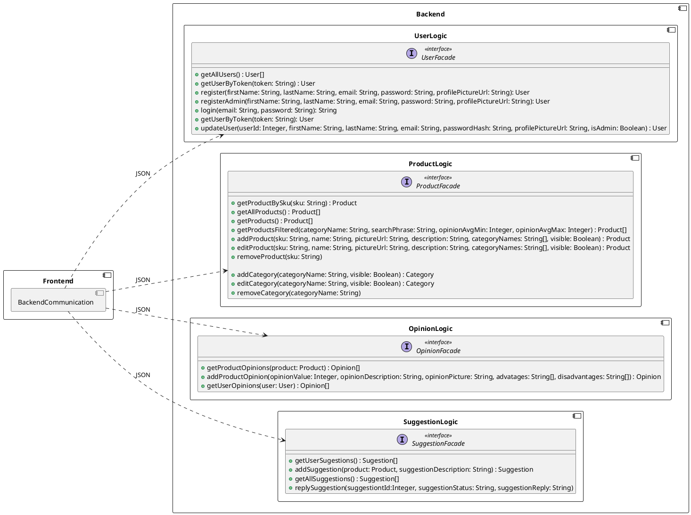

# Frontend - Backend Communication

```plantuml
@startuml
    
component Frontend {    
    component BackendCommunication {
        note as Authors
            Projectants: 
             - Tomasz Roske
             - Antoni Jończyk
        endnote
        note as Description
            Description: 
            Create HTTP queries, send it to backend application,
            process answer.
            
            List of queries:
            - GET /users - get all users data
            - POST /users/register - register new user or admin user
            - POST /users/login - get user data and token
            - PUT /users/update - update user data
            - GET /products - get products
            - GET /products/all - get all products
            - GET /products/search - search products
            - GET /products/details - get products details
            - POST /products/add - add product
            - PUT /products/edit - edit product
            - DELETE /products/delete - remove product
            - POST /categories/add - add category
            - PUT /categories/edit - edit category
            - DELETE /categories/delete - remove category
            - GET /suggestions/user - get user suggestions
            - POST /suggestions/add - add suggestion
            - GET /suggestions/get - get all suggestions
            - PUT /suggestions/reply - reply to suggestion
            - GET /opinions/user - get user opinions
            - GET /opinions/product - get product opinions
            - POST /opinions/add - add opinion
        endnote
    }
}
@enduml 
```

```plantuml
@startuml
left to right direction
component Frontend {
    
    component BackendCommunication {
    }
}

component Backend {
    component UserLogic {
        interface UserFacade <<interface>> {
            + getAllUsers() : User[]
            + getUserByToken(token: String) : User
            + register(firstName: String, lastName: String, email: String, password: String, profilePictureUrl: String): User
            + registerAdmin(firstName: String, lastName: String, email: String, password: String, profilePictureUrl: String): User
            + login(email: String, password: String): String
            + getUserByToken(token: String): User
            + updateUser(userId: Integer, firstName: String, lastName: String, email: String, passwordHash: String, profilePictureUrl: String, isAdmin: Boolean) : User
        }
    }
    component ProductLogic {
        interface ProductFacade <<interface>> {
            + getProductBySku(sku: String) : Product
            + getAllProducts() : Product[]
            + getProducts() : Product[]
            + getProductsFiltered(categoryName: String, searchPhrase: String, opinionAvgMin: Integer, opinionAvgMax: Integer) : Product[]
            + addProduct(sku: String, name: String, pictureUrl: String, description: String, categoryNames: String[], visible: Boolean) : Product
            + editProduct(sku: String, name: String, pictureUrl: String, description: String, categoryNames: String[], visible: Boolean) : Product
            + removeProduct(sku: String)
            
            + addCategory(categoryName: String, visible: Boolean) : Category
            + editCategory(categoryName: String, visible: Boolean) : Category
            + removeCategory(categoryName: String)
        }
    }
    component OpinionLogic {
        interface OpinionFacade <<interface>> {
            + getProductOpinions(product: Product) : Opinion[]
            + addProductOpinion(opinionValue: Integer, opinionDescription: String, opinionPicture: String, advatages: String[], disadvantages: String[]) : Opinion
            + getUserOpinions(user: User) : Opinion[]
        }
    }
    component SuggestionLogic {
        interface SuggestionFacade <<interface>> {
            + getUserSugestions() : Sugestion[]
            + addSuggestion(product: Product, suggestionDescription: String) : Suggestion
            + getAllSuggestions() : Suggestion[]
            + replySuggestion(suggestiontId:Integer, suggestionStatus: String, suggestionReply: String)
        }
    }
}

BackendCommunication  ...> UserFacade: JSON
BackendCommunication  ...> ProductFacade: JSON
BackendCommunication  ...> OpinionFacade: JSON
BackendCommunication  ...> SuggestionFacade: JSON

@enduml 
```