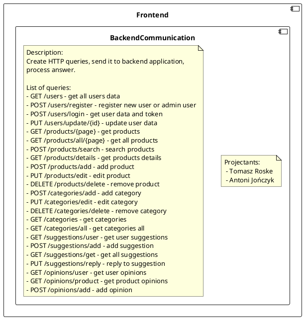
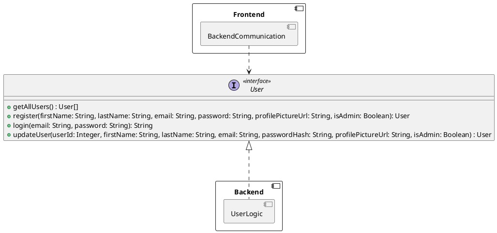
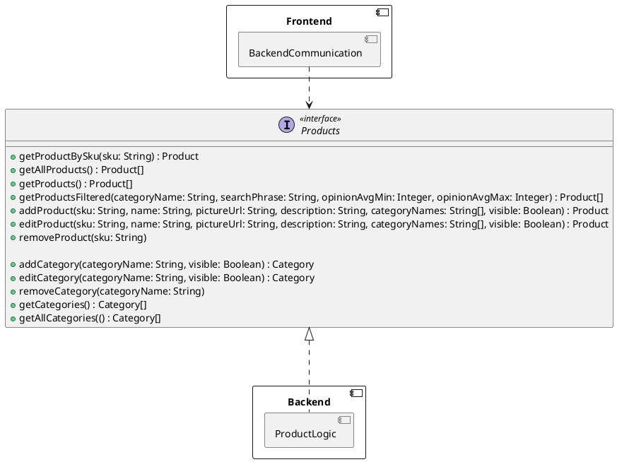
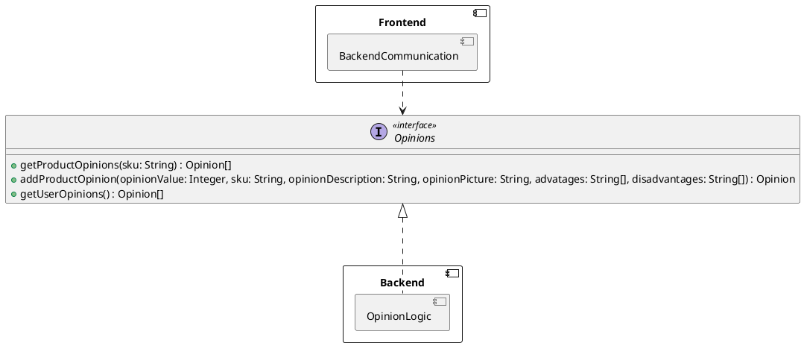
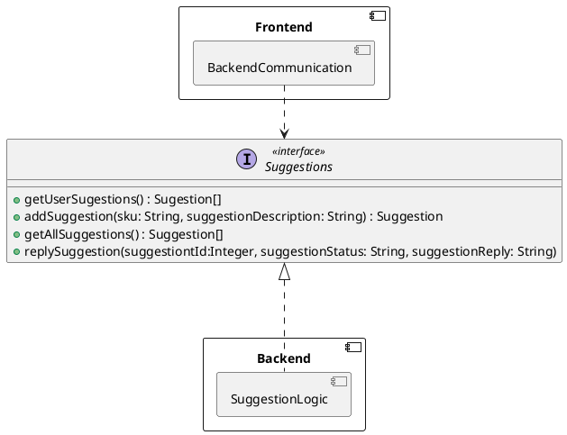
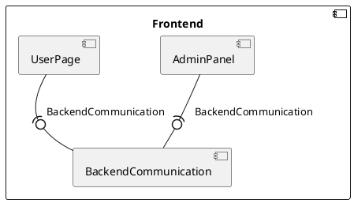
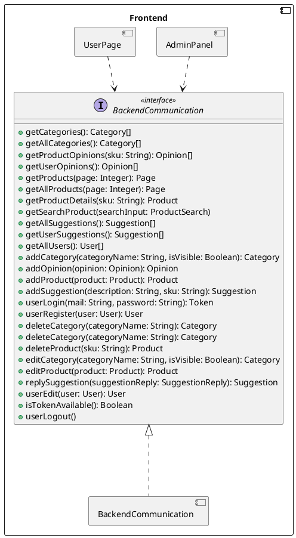

# Frontend - Backend Communication

```plantuml
@startuml
    
component Frontend {    
    component BackendCommunication {
        note as Authors
            Projectants: 
             - Tomasz Roske
             - Antoni Jończyk
        endnote
        note as Description
            Description: 
            Create HTTP queries, send it to backend application,
            process answer.
            
            List of queries:
            - GET /users - get all users data
            - POST /users/register - register new user or admin user
            - POST /users/login - get user data and token
            - PUT /users/update/{id} - update user data
            - GET /products/{page} - get products
            - GET /products/all/{page} - get all products
            - POST /products/search - search products
            - GET /products/details - get products details
            - POST /products/add - add product
            - PUT /products/edit - edit product
            - DELETE /products/delete - remove product
            - POST /categories/add - add category
            - PUT /categories/edit - edit category
            - DELETE /categories/delete - remove category
            - GET /categories - get categories
            - GET /categories/all - get categories all
            - GET /suggestions/user - get user suggestions
            - POST /suggestions/add - add suggestion
            - GET /suggestions/get - get all suggestions
            - PUT /suggestions/reply - reply to suggestion
            - GET /opinions/user - get user opinions
            - GET /opinions/product - get product opinions
            - POST /opinions/add - add opinion
        endnote
    }
}
@enduml 
```
## Interfaces to communication with backend

```plantuml
@startuml
component Frontend {
    component BackendCommunication {
    }
}

component Backend {
    component UserLogic {
    }
}

interface User <<interface>> {
    + getAllUsers() : User[]
    + register(firstName: String, lastName: String, email: String, password: String, profilePictureUrl: String, isAdmin: Boolean): User
    + login(email: String, password: String): String
    + updateUser(userId: Integer, firstName: String, lastName: String, email: String, passwordHash: String, profilePictureUrl: String, isAdmin: Boolean) : User
}

BackendCommunication ..>   User
User                 <|... UserLogic

@enduml 
```

```plantuml
@startuml
component Frontend {
    component BackendCommunication {
    }
}

component Backend {
    component ProductLogic {
    }
}

interface Products <<interface>> {
    + getProductBySku(sku: String) : Product
    + getAllProducts() : Product[]
    + getProducts() : Product[]
    + getProductsFiltered(categoryName: String, searchPhrase: String, opinionAvgMin: Integer, opinionAvgMax: Integer) : Product[]
    + addProduct(sku: String, name: String, pictureUrl: String, description: String, categoryNames: String[], visible: Boolean) : Product
    + editProduct(sku: String, name: String, pictureUrl: String, description: String, categoryNames: String[], visible: Boolean) : Product
    + removeProduct(sku: String)
    
    + addCategory(categoryName: String, visible: Boolean) : Category
    + editCategory(categoryName: String, visible: Boolean) : Category
    + removeCategory(categoryName: String)
    + getCategories() : Category[]
    + getAllCategories(() : Category[]
}

BackendCommunication ..>   Products
Products             <|... ProductLogic

@enduml 
```

```plantuml
@startuml
component Frontend {
    component BackendCommunication {
    }
}

component Backend {
    component OpinionLogic {
    }
}

interface Opinions <<interface>> {
    + getProductOpinions(sku: String) : Opinion[]
    + addProductOpinion(opinionValue: Integer, sku: String, opinionDescription: String, opinionPicture: String, advatages: String[], disadvantages: String[]) : Opinion
    + getUserOpinions() : Opinion[]
}

BackendCommunication ..>   Opinions
Opinions             <|... OpinionLogic

@enduml 
```

```plantuml
@startuml
component Frontend {
    component BackendCommunication {
    }
}

component Backend {
    component SuggestionLogic {
    }
}
interface Suggestions <<interface>> {
    + getUserSugestions() : Sugestion[]
    + addSuggestion(sku: String, suggestionDescription: String) : Suggestion
    + getAllSuggestions() : Suggestion[]
    + replySuggestion(suggestiontId:Integer, suggestionStatus: String, suggestionReply: String)
}

BackendCommunication ..>   Suggestions
Suggestions          <|... SuggestionLogic

@enduml 
```

```plantuml
@startuml
    
component Frontend {
    component AdminPanel {
    }
    
    component UserPage {
    }
    
    component BackendCommunication {
    }

    AdminPanel -(0- BackendCommunication : BackendCommunication
    UserPage -(0- BackendCommunication : BackendCommunication
}

@enduml 
```
## Interface shared for Frontend components

```plantuml
@startuml
component Frontend {
    component AdminPanel {
    }
    
    component UserPage {
    }
    
    component BackendCommunication as BackendCommunicationComponent {
    }
    
    interface BackendCommunication <<interface>>  {
        + getCategories(): Category[]
        + getAllCategories(): Category[]
        + getProductOpinions(sku: String): Opinion[]
        + getUserOpinions(): Opinion[]
        + getProducts(page: Integer): Page
        + getAllProducts(page: Integer): Page
        + getProductDetails(sku: String): Product
        + getSearchProduct(searchInput: ProductSearch)
        + getAllSuggestions(): Suggestion[]
        + getUserSuggestions(): Suggestion[]
        + getAllUsers(): User[]
        + addCategory(categoryName: String, isVisible: Boolean): Category
        + addOpinion(opinion: Opinion): Opinion
        + addProduct(product: Product): Product
        + addSuggestion(description: String, sku: String): Suggestion
        + userLogin(mail: String, password: String): Token
        + userRegister(user: User): User
        + deleteCategory(categoryName: String): Category
        + deleteCategory(categoryName: String): Category
        + deleteProduct(sku: String): Product
        + editCategory(categoryName: String, isVisible: Boolean): Category
        + editProduct(product: Product): Product
        + replySuggestion(suggestionReply: SuggestionReply): Suggestion
        + userEdit(user: User): User
        + isTokenAvailable(): Boolean
        + userLogout()
    }
}


AdminPanel            ..>   BackendCommunication
UserPage              ..>   BackendCommunication
BackendCommunication  <|... BackendCommunicationComponent

@enduml 
```