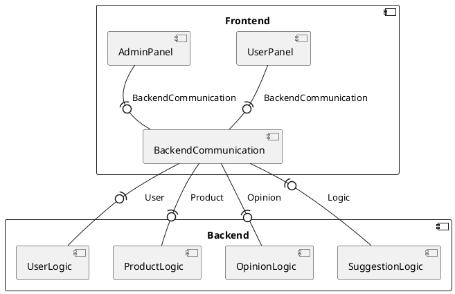

# Frontend

```plantuml
@startuml
    
component Frontend {
    component UserPanel {
    }
    
    component AdminPanel {
    }
    
    component BackendCommunication {
    }
}

component Backend {
    component UserLogic {
    }
    component ProductLogic {
    }
    component OpinionLogic {
    }
    component SuggestionLogic {
    
}


BackendCommunication  -(0- UserLogic       : User
BackendCommunication  -(0- ProductLogic    : Product
BackendCommunication  -(0- OpinionLogic    : Opinion
BackendCommunication  -(0- SuggestionLogic : Logic

UserPanel            -(0-  BackendCommunication : BackendCommunication
AdminPanel           -(0-  BackendCommunication : BackendCommunication

@enduml 
```