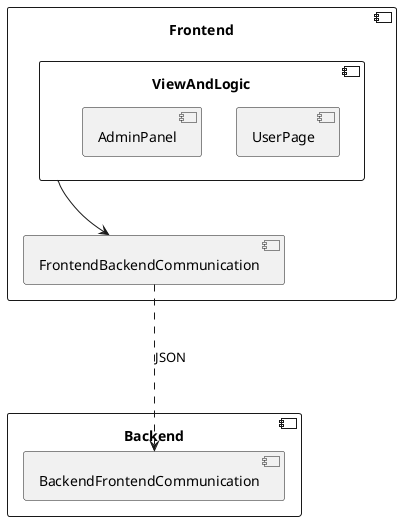

# Frontend

```plantuml
@startuml
    
component Frontend {
    component ViewAndLogic {
        component UserPage {
        }
        component AdminPanel {
        }
    }
    
    component FrontendBackendCommunication {
    }
}

component Backend {
    component BackendFrontendCommunication {
    }
}

FrontendBackendCommunication --.> BackendFrontendCommunication: JSON
ViewAndLogic                 -->  FrontendBackendCommunication

@enduml 
```