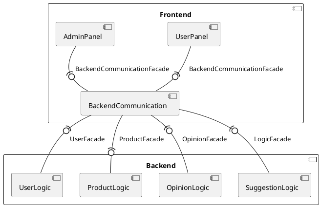

# Frontend

```plantuml
@startuml
    
component Frontend {
    component UserPanel {
    }
    
    component AdminPanel {
    }
    
    component BackendCommunication {
    }
}

component Backend {
    component UserLogic {
    }
    component ProductLogic {
    }
    component OpinionLogic {
    }
    component SuggestionLogic {
    
}


BackendCommunication  -(0- UserLogic       : UserFacade
BackendCommunication  -(0- ProductLogic    : ProductFacade
BackendCommunication  -(0- OpinionLogic    : OpinionFacade
BackendCommunication  -(0- SuggestionLogic : LogicFacade

UserPanel            -(0-  BackendCommunication : BackendCommunicationFacade
AdminPanel           -(0-  BackendCommunication : BackendCommunicationFacade

@enduml 
```