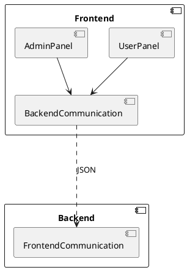

# Frontend

```plantuml
@startuml
    
component Frontend {
    component UserPanel {
    }
    
    component AdminPanel {
    }
    
    component BackendCommunication {
    }
}

component Backend {
    component FrontendCommunication {
    }
}

BackendCommunication ...> FrontendCommunication: JSON
UserPanel            -->  BackendCommunication
AdminPanel           -->  BackendCommunication

@enduml 
```