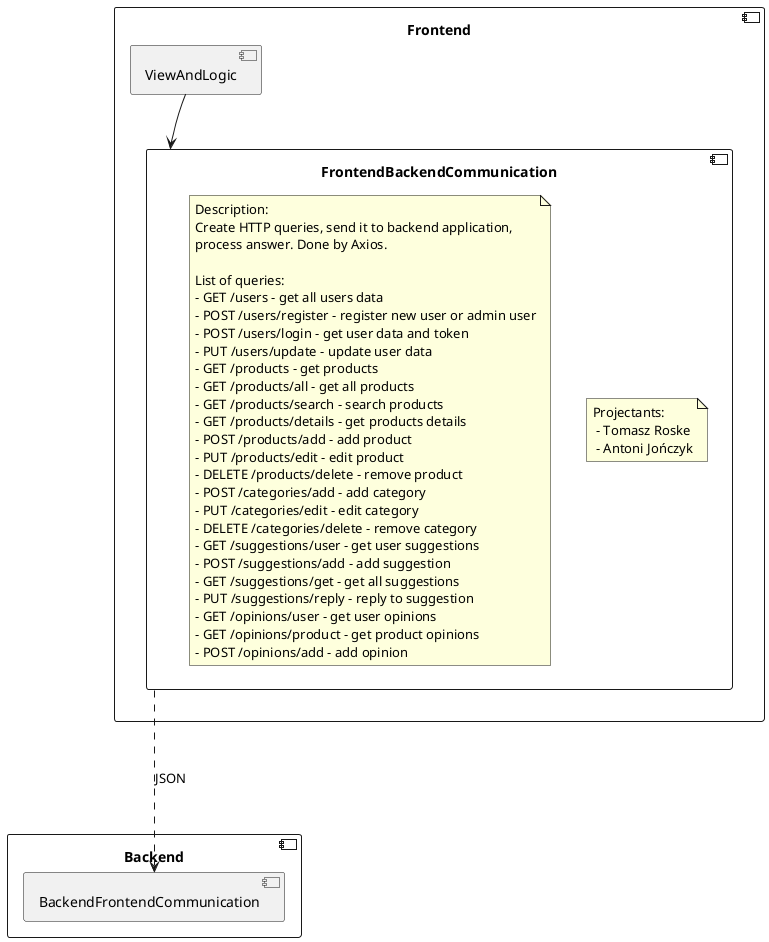

# Frontend - Backend Communication

```plantuml
@startuml
    
component Frontend {
    component ViewAndLogic {
    }
    
    component FrontendBackendCommunication {
        note as Authors
            Projectants: 
             - Tomasz Roske
             - Antoni Jończyk
        endnote
        note as Description
            Description: 
            Create HTTP queries, send it to backend application,
            process answer. Done by Axios.
            
            List of queries:
            - GET /users - get all users data
            - POST /users/register - register new user or admin user
            - POST /users/login - get user data and token
            - PUT /users/update - update user data
            - GET /products - get products
            - GET /products/all - get all products
            - GET /products/search - search products
            - GET /products/details - get products details
            - POST /products/add - add product
            - PUT /products/edit - edit product
            - DELETE /products/delete - remove product
            - POST /categories/add - add category
            - PUT /categories/edit - edit category
            - DELETE /categories/delete - remove category
            - GET /suggestions/user - get user suggestions
            - POST /suggestions/add - add suggestion
            - GET /suggestions/get - get all suggestions
            - PUT /suggestions/reply - reply to suggestion
            - GET /opinions/user - get user opinions
            - GET /opinions/product - get product opinions
            - POST /opinions/add - add opinion
        endnote
    }
}

component Backend {
    component BackendFrontendCommunication {
    }
}

FrontendBackendCommunication --.> BackendFrontendCommunication: JSON
ViewAndLogic                 -->  FrontendBackendCommunication

@enduml 
```