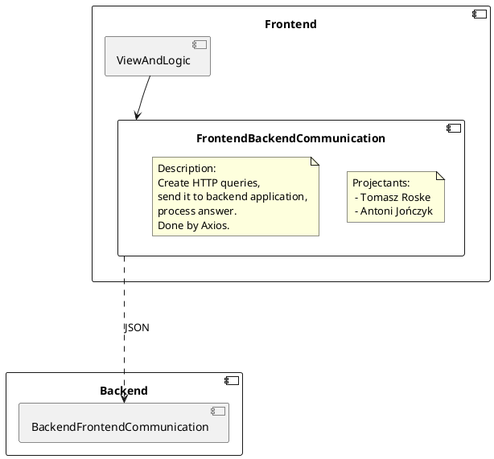

# Frontend - Backend Communication

```plantuml
@startuml
    
component Frontend {
    component ViewAndLogic {
    }
    
    component FrontendBackendCommunication {
        note as Authors
            Projectants: 
             - Tomasz Roske
             - Antoni Jończyk
        endnote
        note as Description
            Description: 
            Create HTTP queries,
            send it to backend application,
            process answer.
            Done by Axios.
        endnote
    }
}

component Backend {
    component BackendFrontendCommunication {
    }
}

FrontendBackendCommunication --.> BackendFrontendCommunication: JSON
ViewAndLogic                 -->  FrontendBackendCommunication

@enduml 
```