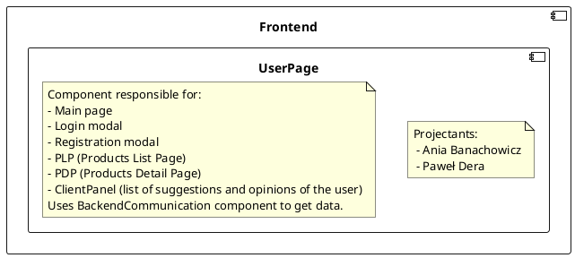
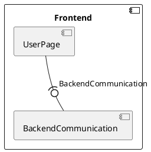

# User Page

```plantuml
@startuml
    
component Frontend {
    component UserPage {
        note as AuthorsUP
            Projectants: 
             - Ania Banachowicz
             - Paweł Dera
        endnote
        note as Description
            Component responsible for:
            - Main page
            - Login modal
            - Registration modal
            - PLP (Products List Page)
            - PDP (Products Detail Page)
            - ClientPanel (list of suggestions and opinions of the user)
            Uses BackendCommunication component to get data.
        endnote
    }
}

@enduml 
```

```plantuml
@startuml
    
component Frontend {
    component UserPage {
    }
    
    component BackendCommunication {
    }
    UserPage -(0- BackendCommunication : BackendCommunication
}

@enduml 
```