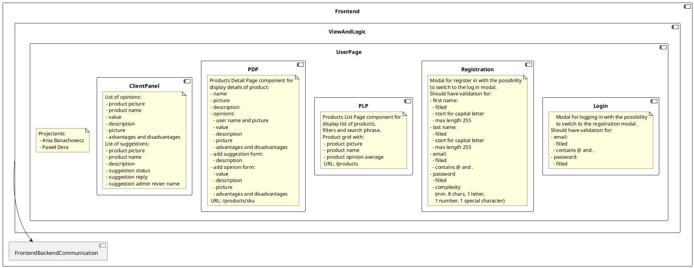

# User Page

```plantuml
@startuml
    
component Frontend {
    component ViewAndLogic {
        component UserPage {
            note as AuthorsUP
                Projectants: 
                 - Ania Banachowicz
                 - Paweł Dera
            endnote
            component Login {
                note as LoginDescription
                    Modal for logging in with the possibility
                    to switch to the registration modal.
                Should have validation for:
                - email:
                  - filled
                  - contains @ and .
                - password:
                  - filled
                endnote
            }
            component Registration {
                note as RegistrationDescription
                    Modal for register in with the possibility
                    to switch to the log in modal.
                    Should have validation for:
                    - first name:
                      - filled
                      - start for capital letter
                      - max length 255
                    - last name:
                      - filled
                      - start for capital letter
                      - max length 255
                    - email:
                      - filled
                      - contains @ and .
                    - password
                      - filled
                      - complexity
                        (min. 8 chars, 1 letter, 
                        1 number, 1 special character)
                endnote
            }
            component PLP {
                note as PlpDescription
                    Products List Page component for
                    display list of products,
                    filters and search phrase.
                    Product grid with:
                     - product picture
                     - product name
                     - product opinion average 
                     URL: /products
                endnote
            }
            component PDP {
                note as PdpDescription
                    Products Detail Page component for
                    display details of product:
                     - name
                     - picture
                     - description
                     - opinions:
                       - user name and picture
                       - value
                       - description
                       - picture
                       - advantages and disadvantages
                     - add suggestion form:
                       - description
                     - add opinion form:
                       - value
                       - description
                       - picture
                       - advantages and disadvantages
                     URL: /products/sku
                endnote
            }
            component ClientPanel {
                note as ClientPanelDescription
                    List of opinions:
                     - product picture
                     - product name
                     - value
                     - description
                     - picture
                     - advantages and disadvantages
                    List of suggestions:
                     - product picture
                     - product name
                     - description
                     - suggestion status
                     - suggestion reply
                     - suggestion admin revier name
                endnote
            }
        }
    }
    
    component FrontendBackendCommunication {
    }
}
ViewAndLogic --> FrontendBackendCommunication

@enduml 
```