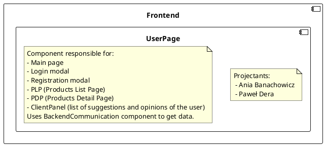
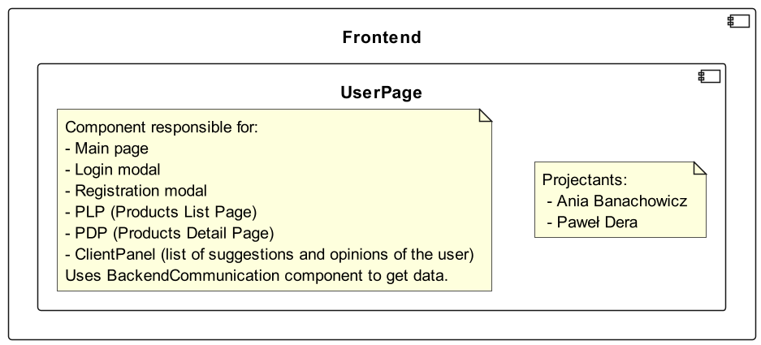
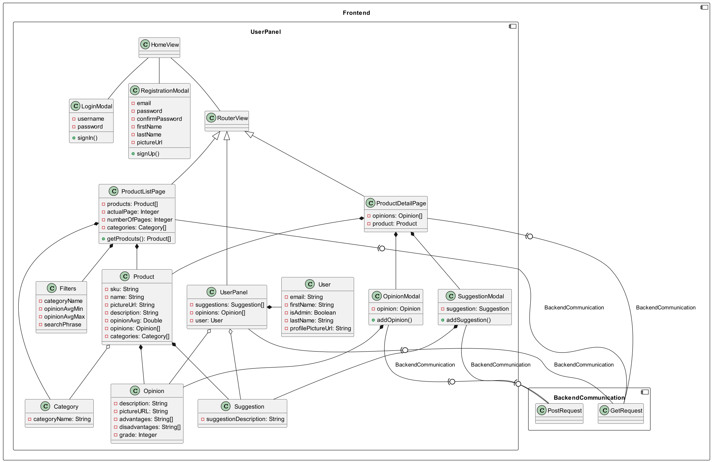

# User Page
## Description
<!--

-->

## Class diagram
<!--
```plantuml
component Frontend {
    component UserPanel {
        class HomeView
        HomeView -- LoginModal
        HomeView -- RegistrationModal
        HomeView -- RouterView
        
        class LoginModal {
            - username
            - password
            + signIn()
        }
        class RegistrationModal {
            - email
            - password
            - confirmPassword
            - firstName
            - lastName
            - pictureUrl
            + signUp()
        }
        class RouterView
        RouterView <|-- ProductDetailPage
        RouterView <|-- ProductListPage
        RouterView <|-- UserPanel
        
        class ProductDetailPage {
            - opinions: Opinion[]
            - product: Product
        }
        ProductDetailPage *-- Product
        ProductDetailPage *-- OpinionModal
        ProductDetailPage *-- SuggestionModal
        
        class ProductListPage {
            - products: Product[]
            - actualPage: Integer
            - numberOfPages: Integer
            - categories: Category[]
            + getProdcuts(): Product[]
        }
        class Filters {
            - categoryName
            - opinionAvgMin
            - opinionAvgMax
            - searchPhrase
        }
        ProductListPage   *-- Product
        ProductListPage   *-- Category
        ProductListPage   *-- Filters
        
        class UserPanel {
            - suggestions: Suggestion[]
            - opinions: Opinion[]
            - user: User
        }
        UserPanel *- User
        UserPanel o-- Suggestion
        UserPanel o-- Opinion
        
        class User {
            - email: String
            - firstName: String
            - isAdmin: Boolean
            - lastName: String
            - profilePictureUrl: String
        }
        class Suggestion {
            - suggestionDescription: String
        }
        class Opinion {
            - description: String
            - pictureURL: String
            - advantages: String[]
            - disadvantages: String[]
            - grade: Integer
        }
        class Product {
            - sku: String
            - name: String
            - pictureUrl: String
            - description: String
            - opinionAvg: Double
            - opinions: Opinion[]
            - categories: Category[]
        }
        class Category {
            - categoryName: String
        }
        
        Product *-- Opinion
        Product *-- Suggestion
        Product o-- Category
        
        class OpinionModal {
            - opinion: Opinion
            + addOpinion()
        }
        OpinionModal *-- Opinion
        
        class SuggestionModal {
            - suggestion: Suggestion
            + addSuggestion()
        }
        SuggestionModal *-- Suggestion
    }
    
    component BackendCommunication {
        class GetRequest
        class PostRequest
    }
    UserPanel         -(0- GetRequest : BackendCommunication
    ProductListPage   -(0- GetRequest : BackendCommunication
    ProductDetailPage -(0- GetRequest : BackendCommunication
    
    OpinionModal    -(0- PostRequest    : BackendCommunication
    SuggestionModal -(0- PostRequest : BackendCommunication
}
```
-->
