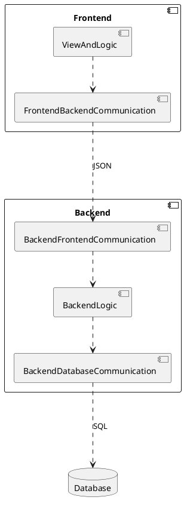

# Layers

```plantuml
@startuml
component Frontend {
    component ViewAndLogic {
    }
    
    component FrontendBackendCommunication {
    }
}

component Backend {
    component BackendFrontendCommunication {
    }
    
    component BackendLogic {
    }
    
    component BackendDatabaseCommunication {
    }
}

database Database {
}

BackendDatabaseCommunication ...> Database: SQL
BackendLogic                 ..>  BackendDatabaseCommunication
BackendFrontendCommunication ..>  BackendLogic
FrontendBackendCommunication ...> BackendFrontendCommunication: JSON
ViewAndLogic                 ..>  FrontendBackendCommunication

@enduml 
```